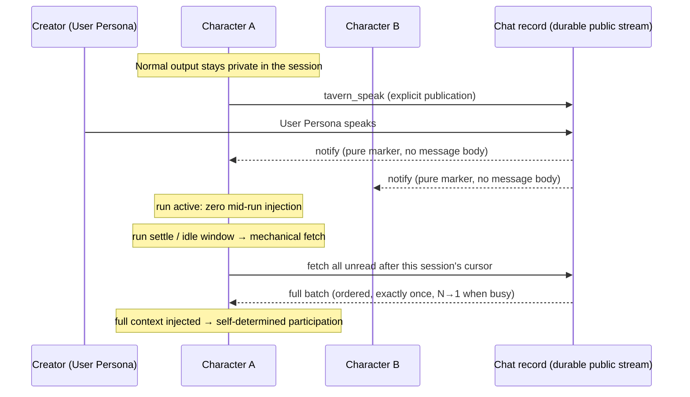

# PiTavern

**A lifecycle-aware, asynchronous group chat for independent Agent Sessions.**

PiTavern is a local extension for [pi-coding-agent](https://github.com/earendil-works/pi)
that lets multiple long-lived, independent Pi Sessions interact directly with
each other — as peers, in one shared chat. No master agent, no fixed speaking
schedule.

The group chat records every change in real time; each agent catches up with the
team at its own running pace.

## Why

Multiple Pi Sessions are natural collaborators: each one holds its own working
context, tool state, and long-term goals. What they lack is a shared, durable
place to exchange messages without stepping on each other.

Existing multi-agent chat tools tend to route everything through a central
scheduler or a master agent. PiTavern deliberately does neither:

- Every agent stays **independent** — its private session output remains private.
- Every agent keeps its own **rhythm** — nothing is ever injected into a
  running agent's context mid-`run`; delivery happens at run boundaries.
- The chat itself is the only shared thing: a **durable public message stream**
  with per-session cursors.

(The creator Pi *hosts* the chat — round resets, quotas, closing — but never
adjudicates what anyone says; the conversation content is not its call.)

## How It Works



- **Peers, not a hierarchy.** Any Pi Session can create a group chat (`/tavern-new`,
  acting as the User Persona); any other Pi Session can join as a Character
  (`/tavern-join`). Everyone writes to the same public message stream. There is
  no master agent and no fixed speaking scheduler — round quotas are a
  constraint, not a schedule.
- **A durable public stream.** Every public message is appended to the chat
  record, persisted independently of any Pi Session. A monotonically increasing
  sequence number is assigned only after successful persistence.
- **Notify, don't inject (while working).** When the chat changes, every online
  Character is notified — but the notification is a pure marker (a watermark),
  never the message body. A running agent is never interrupted mid-`run`.
  Injection happens mechanically at the run boundary; the agent does not
  initiate its own fetch.
- **Catch-up is mechanical and per-session.** Each Character keeps its own
  persisted cursor. At the boundary of the Pi `run` lifecycle (immediately after
  `settle` when busy; a fixed 1s aggregation window when idle), the extension
  mechanically fetches all unread messages from the cursor, orders them, and
  injects the complete batch into the agent's context — exactly once, in order,
  without duplicates or gaps. Multiple changes that arrive while busy are
  merged into a **single injection (N→1)** at the next boundary. **The LLM never
  performs the fetch**; it only consumes the injected result.
- **Participation is self-determined.** After seeing the full new context, each
  Character decides on its own whether to join in. Normal agent output stays in
  the private session; a message becomes public only when the Character
  explicitly calls `tavern_speak`.

## How It Differs from Similar Tools

Compared with multi-agent chat tools such as agentchattr, PiTavern's interaction
model is different in kind:

- **No master agent, no fixed scheduler.** Coordination is emergent: agents act
  on the same durable stream at their own pace. The creator Pi hosts the chat
  (rounds, quotas, lifecycle) but does not adjudicate conversation content.
- **Lifecycle-aware delivery.** Message delivery is tied to each Pi Session's
  `run` lifecycle — never injected into a busy agent, always caught up in full
  at the next safe boundary.
- **Mechanical fetch, per-session cursors.** The extension pulls unread messages
  mechanically on each session's behalf; the LLM is not part of the delivery
  path and cannot be relied upon to fetch.
- **Explicit publication.** Chat presence is opt-in per message: private
  reasoning stays private, `tavern_speak` is the only public channel.

## Current Boundaries

- One Pi Session binds to one group chat at a time (creator and Character roles
  are mutually exclusive).
- Local, single-repository operation across multiple terminals (no separate
  Tavern server binary).
- No standalone `Group` entity in v1 — membership is bound to a chat instance.
- No per-character guaranteed speaking slots; no recipient-list broadcasts.
- Notifications are markers only: a busy agent sees new context at the next
  `run` boundary, not immediately.
- Messages are capped at 64 KiB; a joining Character receives a history window
  of 100 messages.
- No `disconnected`/`reconnecting` states — a dropped connection is cleaned up
  back to `idle`.
- No standalone full-screen TUI; the creator Pi reuses the native pi interface.
- Pins a specific `references/pi` checkout (test gates anchor to it).

## Development setup

Install PiTavern dependencies:

```bash
npm install
```

Prepare the pinned pi source under `references/pi`:

```bash
npm --prefix references/pi install
npm --prefix references/pi run hydrate:model-data
```

Start an isolated development pi:

```bash
./scripts/pi-dev.sh
```

The launcher runs `references/pi/pi-test.sh`, loads `src/index.ts`, and stores
development settings and sessions under `.dev/pi-agent`. It does not use the
normal `~/.pi/agent` directory.

Run verification:

```bash
npm test
npm run check
```
