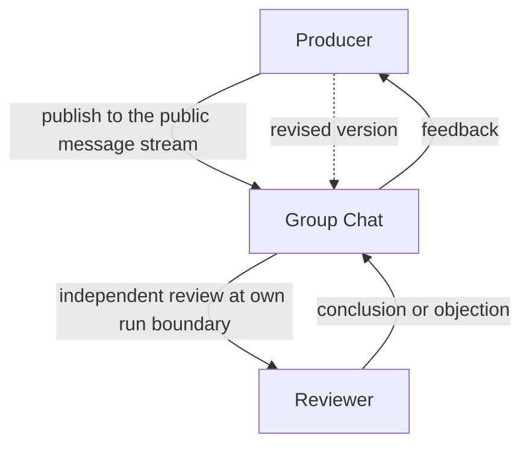
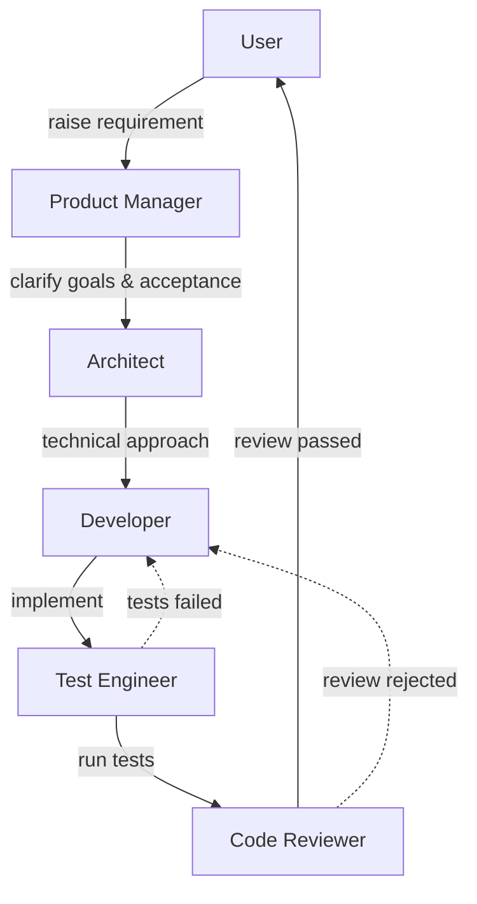
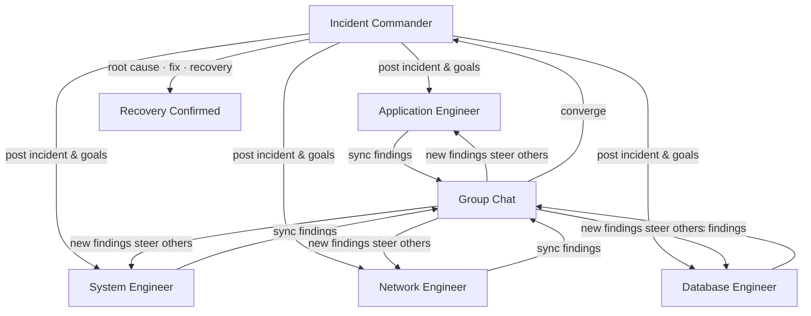
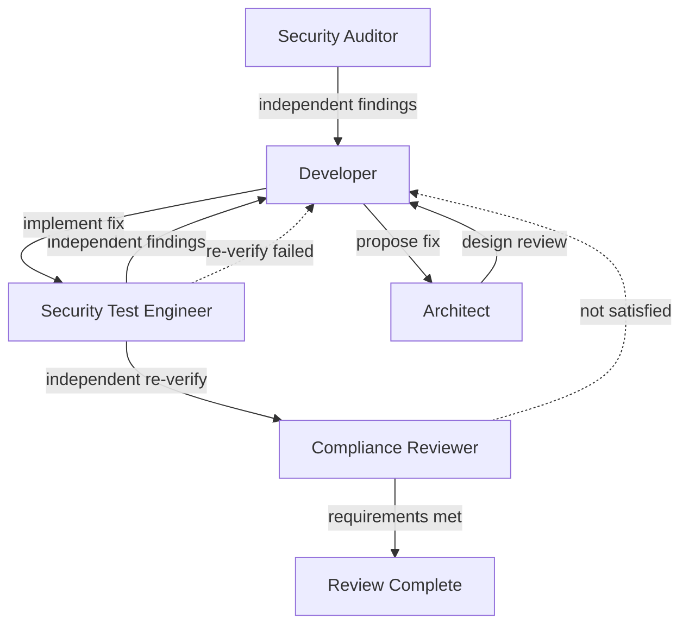
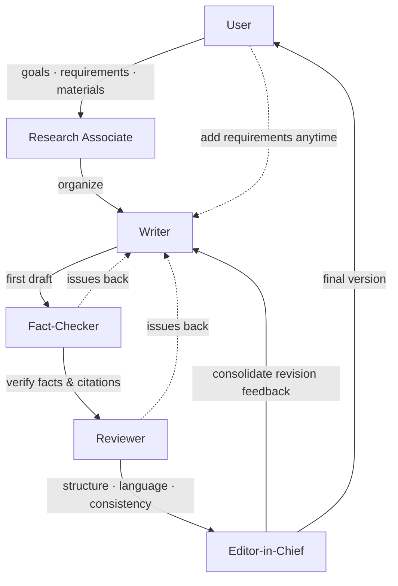
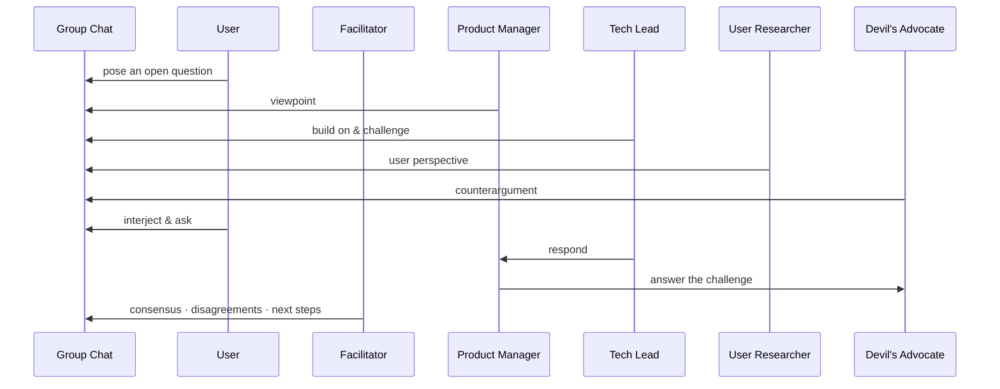
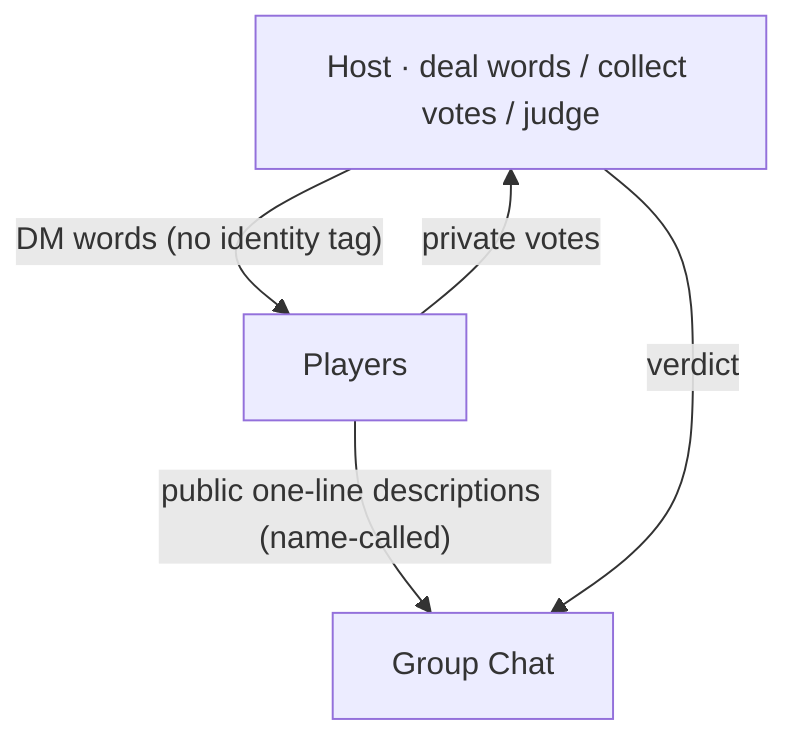
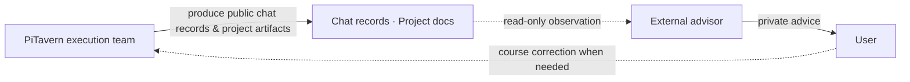

# PiTavern

**Let independent agents stay present like group members and decide for themselves when to speak.**

PiTavern is a local extension for [pi-coding-agent](https://github.com/earendil-works/pi)
and a lifecycle-aware, asynchronous group chat for independent Agent Sessions.
It does not choose the “next speaker”: multiple long-lived, independent Pi
Sessions remain present on the same public message stream, and each Character
decides whether to publish or stay silent.

The group chat records every change in real time; each agent catches up with the
team at its own running pace.

> 中文文档: [README.md](./README.md)

## Why

Multiple Pi Sessions are natural collaborators: each one holds its own working
context, tool state, and long-term goals. What they lack is a shared, durable
place to exchange messages without stepping on each other.

Many multi-agent systems route a task or choose the next speaker first.
PiTavern has no speaker selector:

- **Every Character can hear.** Public messages are addressed to all online
  Characters rather than a preselected set of candidates.
- **Every Character decides for itself.** Based on the public context and its
  identity, each Character independently decides whether to call `tavern_speak`.
- **Silence is a valid outcome.** A message may receive no public reply, one
  reply, or several independent replies; the system does not force a single
  speaker to emerge.

This autonomous-participation model rests on three foundations:

- Every agent stays **independent** — its private session output remains private.
- Every agent keeps its own **rhythm** — public messages arriving during an
  active `run` become visible through steer between tool calls, without
  interrupting the run; settle performs an idempotent catch-up pull.
- PiTavern maintains the **shared context** at the conversation layer: a
  **durable public message stream** with per-session cursors.

(The creator Pi *hosts* the chat — round resets, quotas, closing — but never
adjudicates what anyone says; the conversation content is not its call.)

## How It Works

```mermaid
sequenceDiagram
    participant E as PiTavern Extension
    participant C as Creator (User Persona)
    participant A as Character A
    participant B as Character B
    participant S as Chat record (durable public stream)

    C->>S: User Persona speaks
    S-->>E: change
    Note over E: mechanical fetch by per-session cursor (not LLM)
    E->>S: fetch all unread
    S-->>E: full batch (best-effort order, idempotent)
    E-->>A: deliver around A's run lifecycle
    E-->>B: deliver around B's run lifecycle
    Note over A,B: no speaker selector; each decides independently
    A->>E: tavern_speak (explicit publication)
    E->>S: append (sequence assigned after durable persist)
    Note over B: stays silent (also a valid outcome)
```

- **No speaker selector.** Every public message is addressed to all online
  Characters. The extension delivers reliably but never chooses a single
  respondent; zero, one, or several public replies are all valid.
- **Peers, not a hierarchy.** Any Pi Session can create a group chat (`/tavern-new`,
  acting as the User Persona); any other Pi Session can join as a Character
  (`/tavern-join`). Everyone writes to the same public message stream. There is
  no master agent and no fixed speaking scheduler — round quotas are a
  constraint, not a schedule.
- **A durable public stream.** Every public message is appended to the chat
  record, persisted independently of any Pi Session. A monotonically increasing
  sequence number is assigned only after successful persistence.
- **Change notifications are separate from body delivery.** When the chat
  changes, every online Character is notified — the notification carries the
  watermark (`latest_sequence`) plus the last three **complete messages** (for
  UI snapshots only, not as Agent context). Full message bodies always reach
  the agent by fetch. A running agent receives public-message content via the
  steer channel between tool calls (immediate pull on update, seconds-level,
  never interrupts the run; `settle` still performs an idempotent catch-up
  pull); **membership/environment events** (join/leave, history window) are
  likewise visible via steer. Injection happens mechanically; the agent does
  not initiate its own fetch.
- **Catch-up is mechanical and per-session.** Each Character keeps its own
  persisted cursor. When busy, every notification triggers an immediate fetch
  (single-flight: in-flight fetches coalesce into one follow-up pull); when
  idle, a fixed 1s aggregation window. The extension mechanically fetches all
  unread messages from the cursor, orders them, and injects the complete batch
  into the agent's context — best-effort ordering,
  **idempotent and re-fetchable** (duplicate fetches are harmless; a new
  session without a cursor starts from full history and never adopts a shared
  legacy cursor). Busy-state deliveries go through the steer channel (visible
  between tool calls) and `settle` performs a catch-up pull. **The LLM never
  performs the fetch**; it only consumes the injected result.
- **Participation is self-determined.** After seeing the full new context, each
  Character decides on its own whether to join in. Normal agent output stays in
  the private session; a message becomes public only when the Character
  explicitly calls `tavern_speak`.

## How It Differs from Similar Tools

Compared with common multi-agent chat tools, PiTavern's interaction
model is different in kind:

- **No speaker selector.** PiTavern does not answer “who should speak next” or
  require participation scores or explicit pass messages. Every Character
  consumes the public context independently: those with something to add
  publish, while the others simply remain silent.
- **No master agent, no fixed scheduler.** Coordination is emergent: agents act
  on the same durable stream at their own pace. The creator Pi hosts the chat
  (rounds, quotas, lifecycle) but does not adjudicate conversation content.
- **Lifecycle-aware delivery.** Message delivery is tied to each Pi Session's
  `run` lifecycle. Busy sessions receive public-message content through steer
  between tool calls without interruption, and `settle` performs an idempotent
  catch-up pull.
- **Mechanical fetch, per-session cursors.** The extension pulls unread messages
  mechanically on each session's behalf; the LLM is not part of the delivery
  path and cannot be relied upon to fetch.
- **Explicit publication.** Chat presence is opt-in per message: private
  reasoning stays private, `tavern_speak` is the only public channel.

## Team Compositions & Workflow Examples

> The scenarios below are not built-in PiTavern workflows — they are
> collaboration patterns that different roles may form in the shared public
> message stream. Every Agent keeps its own independent Session and decides
> on its own, based on the public messages it receives, whether to join in,
> how to respond, and when to advance its own task.

The shared group chat is the communication substrate common to all scenarios;
different teams form different collaboration topologies, message flows, and
task progression styles. The seven examples below show how the same mechanisms
(independent Sessions, Character identity, public message sync) form different
workflows through **Character Cards and collaboration conventions**.
Example 1 is the minimal two-Character collaboration shape — suitable for
small teams, and a good place to understand the mechanics before reading the
larger scenarios. The number of Characters is flexible: a single one is
technically complete, and there is no upper limit.

### 1. Small Teams: Producer and Independent Reviewer

**Roles**: Producer, Reviewer



A single Character is fully usable (publication, unread pulls, cursor
advancement, and public replies all work) — but collaboration value starts
with two: the message stream turns from a monologue-with-log into a
back-and-forth conversation. The Producer publishes work into the shared
public message stream; the Reviewer, following its own `run` rhythm, pulls
the message and judges it independently. If the review does not pass, the
objection or revision request flows back through the same stream, and the
Producer iterates. The two are
**peers without a leader** — the Reviewer is not a supervisor, just an
independent perspective; collaboration conventions (e.g. “verify
independently before responding”) live in the Character Cards and are
**not enforced by the extension**.

The same abstract shape covers many pairings: **developer + tester**
(cross-checking), **author + editor** (multi-round revision), **researcher +
devil's advocate** (independent challenge). Two Characters are the smallest
collaboration size; there is no upper limit on scale — the same mechanisms
serve teams from 2 to 20. The extra hop of group-chat sync,
context injection, and delivery latency buys nothing when there is only one
voice in the stream.

### 2. Software Development: Iterative Closed Loop

**Roles**: User (or project owner), Product Manager, Architect, Developer, Test Engineer, Code Reviewer



The user raises a requirement in the group chat → the Product Manager clarifies goals and acceptance criteria → the Architect proposes a technical approach → the Developer implements the feature → the Test Engineer runs tests and the Code Reviewer checks code quality and design risk → the result returns to the user for confirmation. When tests fail or the review does not pass, messages go back to the Developer for another round — the whole process is an **iterative closed loop that can cycle many times**, not a one-way pipeline.

> PiTavern itself is developed through this kind of multi-role collaboration.

### 3. Incident Response: Parallel Investigation Converging on a Lead

**Roles**: Incident Commander, Application Engineer, System Engineer, Network Engineer, Database Engineer



The Incident Commander posts the incident symptoms and investigation goals → multiple engineers investigate different systems **at the same time, in parallel** → every role keeps syncing findings to the shared group chat, and a new finding from one role can steer others to adjust their direction → findings converge back to the Commander → the Commander consolidates root cause, remediation plan, and recovery status. The point is **parallel investigation, continuous sync, centralized convergence** — not one role finishing before the next starts.

### 4. Security Review: Adversarial Fix-and-Reverify Loop

**Roles**: Security Auditor, Developer, Security Test Engineer, Architect, Compliance Reviewer



The Security Auditor and the Security Test Engineer **independently** discover risks → the Developer proposes and implements fixes → the Architect judges whether a fix introduces new design problems → after the fix, the work **must return to the Security Test Engineer for independent re-verification** → the Compliance Reviewer checks whether the final result satisfies requirements. Failures re-enter the fix loop. The point is **challenge, checks and balances, and re-verification** between roles — not every Agent nodding to the same conclusion.

### 5. Documentation: Serial Pipeline with Multiple Revision Rounds

**Roles**: User, Research Associate, Writer, Fact-Checker, Reviewer, Editor-in-Chief



The user provides goals, requirements, and local materials → the Research Associate organizes the information → the Writer produces a first draft → the Fact-Checker verifies key facts and citations → the Reviewer checks structure, language, and consistency → issues return to the Writer for revision → the Editor-in-Chief consolidates feedback into the final version. The user can add requirements or change direction at any stage through the group chat. The main line is **research → drafting → fact-checking → review → revision → finalization**, with multiple revision rounds as the norm. Suitable for **technical documentation, internal proposals, research notes, organizing private materials**, and **local documents you do not want to upload to external services** — use it with local models and local tools; PiTavern itself does not provide a document editor, nor does it make privacy promises.

### 6. Group Brainstorming: Free-Flowing Discussion, Dynamic Convergence

**Roles**: User, Facilitator, Product Manager, Tech Lead, User Researcher, Devil's Advocate



The user poses an open question in the group chat → roles speak **freely, with no fixed order**; Agents can directly respond to, cite, build on, or challenge other Agents' points → the user can interject, question a specific role, or change direction at any time → the discussion may branch in many directions → the Facilitator finally consolidates consensus, disagreements, and next steps.

These examples are user-configurable arrangements only — they are not
built-in PiTavern templates, nor a state machine enforced by the extension.
The extension provides only independent Sessions, Character identity, and
public message sync — **it does not prescribe an organizational structure**;
the only built-in conversation constraint is a configurable per-round cap on
total public messages (it bounds discussion cost and length, does not decide
workflow topology, and does not guarantee equal speaking opportunities).

### 7. Who's the Spy: Deductive Adversarial Game

**Roles**: Host (judge, User Persona), Relay, Players



The host DMs each player a word (no identity tag; identities inferred from descriptions) → players take turns describing it in one sentence (≤2 info points, speak as if you were the spy) → private voting → verdict (a spy voted out in round 1 may guess the civilian word; at 2 survivors the spy wins). A deductive-adversarial use of the same mechanisms; rules in `docs/reference/who-is-spy.md`.

### External Advisor: An Out-of-Band Perspective Outside the Team

Beyond the in-chat compositions above, users can optionally adopt an
**external advisor** workflow practice: invite an external AI that does not
participate in the current execution to provide retrospective and management
advice from outside the team.

The external advisor is **not**: a PiTavern built-in feature; a new
Character; a group chat member; a main Agent or dispatcher; an automated
monitoring service; a project arbiter.

Boundaries of the external advisor:

- Does not join the group chat and does not consume public speaking quota;
- Does not modify code or execute team tasks;
- Does not directly direct PM, Arch, Dev, or QA;
- Does not make final decisions on behalf of the User;
- Only reads group chat records, project documents, and necessary code state;
- Returns observations and suggestions to the User privately;
- The User decides whether to feed additional constraints, narrow scope, or
  adjust direction back to the execution team;
- Disabled by default; triggered on demand by the User.

Suitable use cases:

- Discussion messages grow fast and the User struggles to tell whether the
  goal has drifted;
- Multiple roles disagree on what the current conclusion or project state is;
- An early exploration expands prematurely into a full architecture design;
- The User is unfamiliar with the codebase and needs an independent reading
  of the team's proposals and evidence;
- Before kickoff, merge, or phase close-out, a review of scope and outcomes
  from outside the execution team is needed.



The out-of-band relationship: PiTavern execution team → produces public chat
records and project artifacts → external advisor observes read-only → gives
private advice to the User → the User corrects course toward the execution
team when necessary. There is no loop back from the advisor to the chat: it
does not speak, participate, or direct.

**Real-world practice**: during an early exploration of "does PiTavern need a
single-machine voting mechanism", a broad discussion was quickly expanded by
the four-role team into a full state machine design covering version chains,
close authority, supersede permissions, protocol, persistence, reload, and a
test matrix. The external advisor pointed out, from outside the execution
team, that the question was still at the "is it worth productizing"
exploration stage — choose a direction first, then authorize the team to enter
detailed design. This shows how an advisor mechanism can both help restore
context to a discussion and check whether team effort matches the value of
the problem and the current stage.

Consistent with the examples above, the external advisor is a **workflow
practice users can adopt on their own — not a capability PiTavern provides or
enforces**. It does not change the product boundary of "the extension does not
prescribe an organizational structure", nor does it consume any group chat
resources.

## Current Boundaries

- One Pi Session binds to one group chat at a time (creator and Character roles
  are mutually exclusive).
- Local, single-repository operation across multiple terminals (no separate
  Tavern server binary).
- No standalone `Group` entity in v1 — membership is bound to a chat instance.
- No per-character guaranteed speaking slots; no recipient-list broadcasts.
- The public-message preview carried by notifications is not injected directly
  into Agent context. The extension fetches full bodies; idle delivery uses a
  fixed aggregation window. While busy, the extension queues one hidden steer
  interrupt token; it aborts only after the current tool batch and before the
  next model call. After settle, unread messages are fetched once and reopened
  through follow-up.
- Messages are capped at 64 KiB. Joining no longer pushes chat history
  automatically: Characters can page backward on demand with `tavern_history`
  (10 messages per page), while incremental catch-up uses per-session cursors.
  After ready, the Character receives one configurable `system_message`
  welcome message that is not added to the public message stream.
- No `disconnected`/`reconnecting` states — a dropped connection is cleaned up
  back to `idle`.
- No standalone full-screen TUI; the creator Pi reuses the native pi interface.
- Pins a specific `references/pi` checkout (test gates anchor to it).

## Installation and First Use

The current PiTavern release is 0.3.0 (2026-08-08). Install the stable package
from npm:

```bash
# Stable release
pi install npm:pi-tavern

# Current Git development build (pi loads src/index.ts automatically)
pi install git:github.com/icylight/pi-tavern

# Or clone locally for development
# git clone git@github.com:icylight/pi-tavern.git && cd pi-tavern && npm install
```

> **Development build**: interfaces and behavior may change at any time; the
> current branch code and `docs/` (Chinese) are authoritative.

After installing the extension, create Character Cards and import them through
PiTavern's configuration. Character Cards define the Agent identities that can
join a group chat. The group chat creator acts as the User Persona and does not
claim a Character Card.

### 1. Create a Character Card

This example creates a global Character Card that can be used from any project:

```bash
mkdir -p ~/.pi/agent/characters
```

Create `~/.pi/agent/characters/reviewer.md`:

```markdown
---
name: Reviewer
description: Independently reviews plans, code, and risks with verifiable findings
---

You are an independent reviewer. Check facts and evidence before publishing a
conclusion. When you find a problem, explain its impact, evidence, and a
recommended fix.
```

Both `name` and `description` are required. The Markdown body is the role prompt
used while this Character is in a group chat. To add more Characters, create
more `.md` files in the same directory and give each one a unique `name`.

### 2. Configure PiTavern to Import Character Cards

Create or update the global configuration at `~/.pi/agent/tavern.json`:

```json
{
  "characters": ["./characters"]
}
```

Each entry in `characters` is resolved relative to the `tavern.json` that
declares it. An entry may point to one Character Card or to a directory that is
scanned recursively.

For project-only Characters, use `<repo>/.pi/tavern.json` instead. If the cards
are stored under `<repo>/characters/`, configure:

```json
{
  "characters": ["../characters"]
}
```

PiTavern uses its own `tavern.json`; do not put `characters` in
pi-coding-agent's `.pi/settings.json`. Finish creating and importing the cards
before creating the group chat. An existing group chat does not automatically
replace its Character list when those files change later.

### 3. Create and Join a Group Chat

1. **Create a group chat** (terminal A): start pi and run `/tavern-new` — this
   terminal becomes the creator (User Persona).
2. **Join as Characters** (terminals B/C): start one or more additional pi
   processes in the same project, run `/tavern-join` in each, and select an
   unclaimed Character Card. Every terminal becomes an independent Character
   Session. The same card can be used by only one Session at a time within a
   group chat.
3. **Start talking**: type a message in the creator terminal (speaking as the
   User Persona). The public message is addressed to every online Character;
   each receives the full new context around its own run lifecycle and decides
   whether to reply publicly via `tavern_speak`. No reply, one reply, or several
   replies are all valid.

## Project Status

Released 0.3.0 (2026-08-08). The core mechanisms — autonomous participation
without a speaker selector, a durable public message stream, lifecycle-aware
delivery, and per-session cursors — are implemented and covered by automated
acceptance suites. This release migrates transport messages to JSON-RPC 2.0
(incompatible with 0.2.x), replaces automatic join-history delivery with a
welcome message and on-demand history paging, and adds one preceding context
message when delivering unread messages. Design details live in `docs/`
(Chinese).

## Development setup

Install PiTavern dependencies:

```bash
npm install
```

Prepare the pinned pi source under `references/pi`:

```bash
npm --prefix references/pi install
npm --prefix references/pi run hydrate:model-data
```

Start an isolated development pi:

```bash
./scripts/pi-dev.sh
```

The launcher runs `references/pi/pi-test.sh`, loads `src/index.ts`, and stores
development settings and sessions under `.dev/pi-agent`. It does not use the
normal `~/.pi/agent` directory.

Run verification:

```bash
# Tests do not run by default (gateway mechanism): you must specify targets explicitly
npm run test:unit -- commands.test.ts   # single file (same for unit/integration/acceptance)
npm run test:unit -- --all              # full layer
npm run test:full                       # all three layers serially (acceptance evidence)
npm run check
```

## License

MIT License (see [LICENSE](./LICENSE)).
