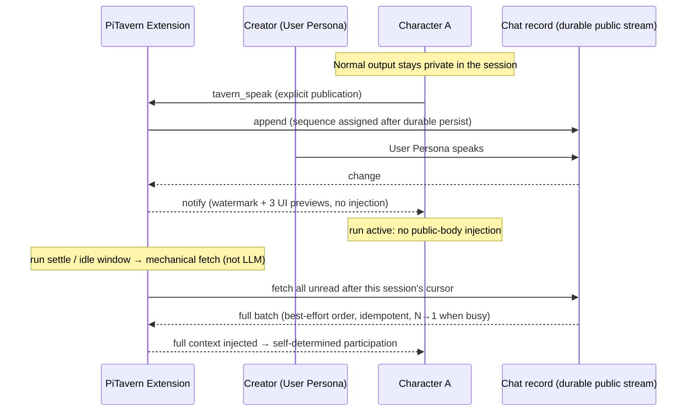
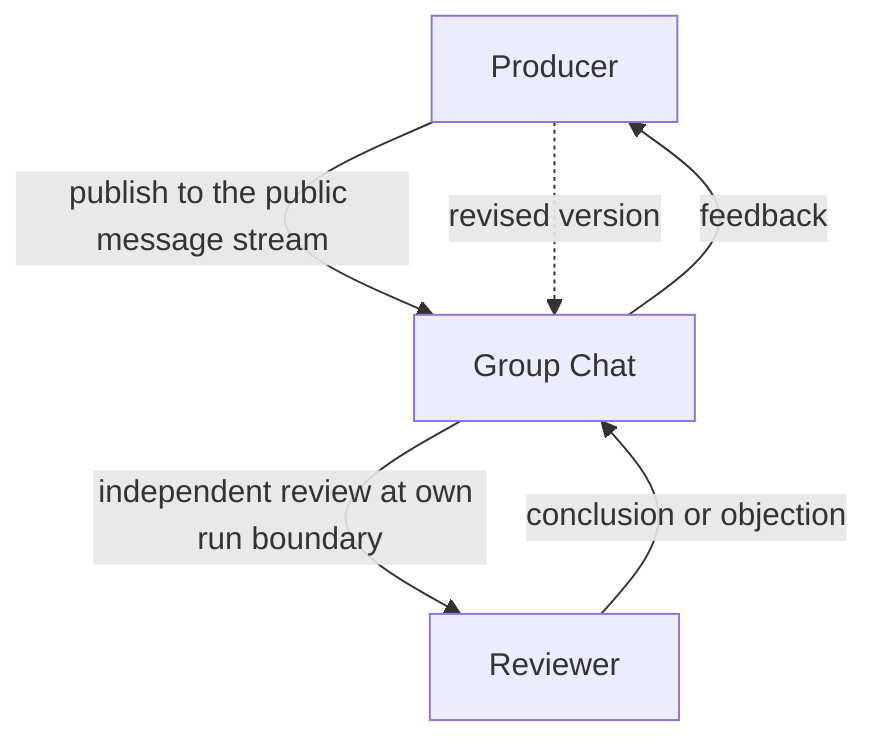
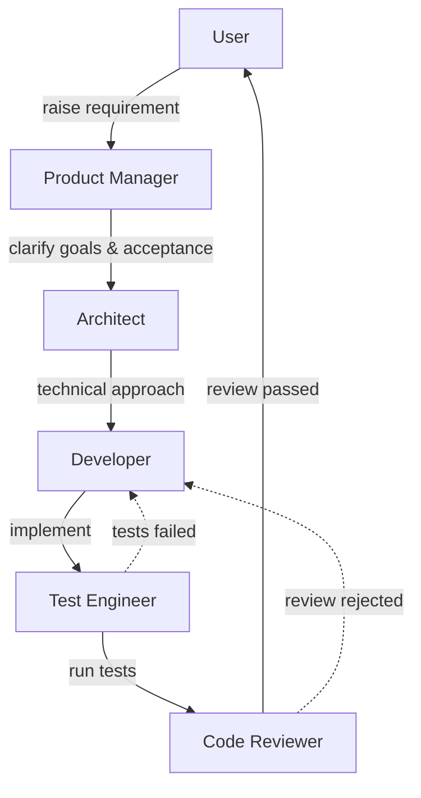
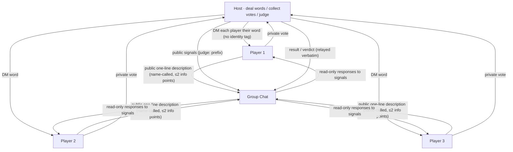
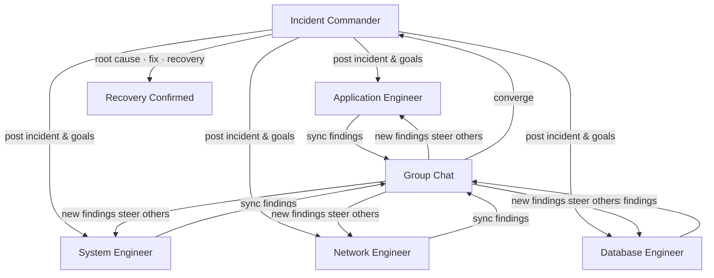
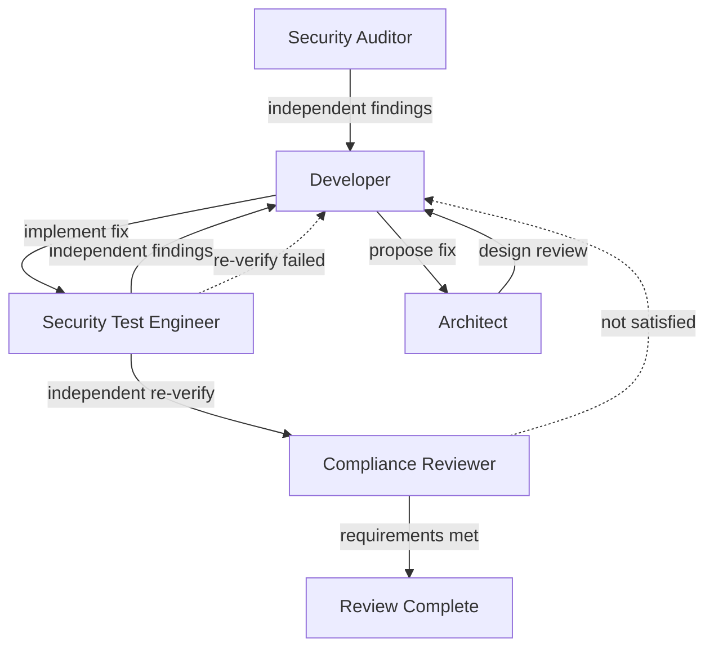
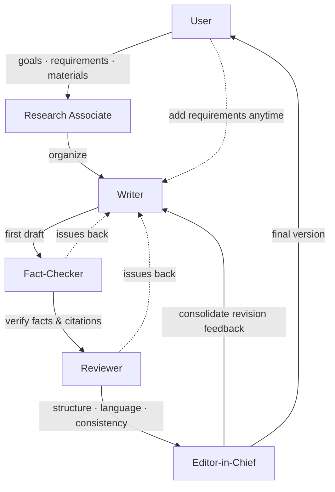
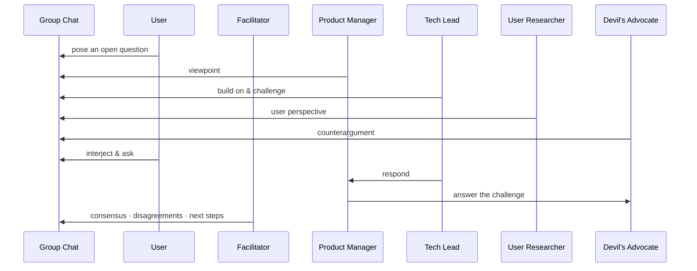
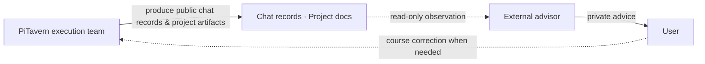

# PiTavern

**A lifecycle-aware, asynchronous group chat for independent Agent Sessions.**

PiTavern is a local extension for [pi-coding-agent](https://github.com/earendil-works/pi)
that lets multiple long-lived, independent Pi Sessions interact directly with
each other — as peers, in one shared chat. No master agent, no fixed speaking
schedule.

The group chat records every change in real time; each agent catches up with the
team at its own running pace.

> 中文文档: [README.md](./README.md)

## Why

Multiple Pi Sessions are natural collaborators: each one holds its own working
context, tool state, and long-term goals. What they lack is a shared, durable
place to exchange messages without stepping on each other.

Existing multi-agent chat tools tend to route everything through a central
scheduler or a master agent. PiTavern deliberately does neither:

- Every agent stays **independent** — its private session output remains private.
- Every agent keeps its own **rhythm** — no new public-message body is ever
  injected during an active `run` (membership/environment events may still be
  visible via steer between tool calls); delivery happens at run boundaries.
- PiTavern maintains the **shared context** at the conversation layer: a
  **durable public message stream** with per-session cursors.

(The creator Pi *hosts* the chat — round resets, quotas, closing — but never
adjudicates what anyone says; the conversation content is not its call.)

## How It Works



- **Peers, not a hierarchy.** Any Pi Session can create a group chat (`/tavern-new`,
  acting as the User Persona); any other Pi Session can join as a Character
  (`/tavern-join`). Everyone writes to the same public message stream. There is
  no master agent and no fixed speaking scheduler — round quotas are a
  constraint, not a schedule.
- **A durable public stream.** Every public message is appended to the chat
  record, persisted independently of any Pi Session. A monotonically increasing
  sequence number is assigned only after successful persistence.
- **Notify, don't inject (while working).** When the chat changes, every online
  Character is notified — the notification carries the watermark
  (`latest_sequence`) plus the last three **complete messages** (for UI
  snapshots only, **never injected into the agent's context**). Full message
  bodies always reach the agent by fetch. A running agent receives
  public-message content via the steer channel between tool calls (immediate
  pull on update, seconds-level, never interrupts the run; `settle` still
  performs an idempotent catch-up pull); **membership/environment events**
  (join/leave, history
  window) are likewise visible via steer. Injection happens mechanically; the
  agent does not initiate its own fetch.
- **Catch-up is mechanical and per-session.** Each Character keeps its own
  persisted cursor. When busy, every notification triggers an immediate fetch
  (single-flight: in-flight fetches coalesce into one follow-up pull); when
  idle, a fixed 1s aggregation window. The extension
  mechanically fetches all unread messages from the cursor, orders them, and
  injects the complete batch into the agent's context — best-effort ordering,
  **idempotent and re-fetchable** (duplicate fetches are harmless; a new
  session without a cursor starts from full history and never adopts a shared
  legacy cursor). Busy-state deliveries go through the steer channel (visible
  between tool calls) and `settle` performs a catch-up pull. **The LLM never performs the fetch**;
  it only consumes the injected result.
- **Participation is self-determined.** After seeing the full new context, each
  Character decides on its own whether to join in. Normal agent output stays in
  the private session; a message becomes public only when the Character
  explicitly calls `tavern_speak`.

## How It Differs from Similar Tools

Compared with common multi-agent chat tools, PiTavern's interaction
model is different in kind:

- **No master agent, no fixed scheduler.** Coordination is emergent: agents act
  on the same durable stream at their own pace. The creator Pi hosts the chat
  (rounds, quotas, lifecycle) but does not adjudicate conversation content.
- **Lifecycle-aware delivery.** Message delivery is tied to each Pi Session's
  `run` lifecycle — no new public-message body is injected during an active
  run; the session always catches up in full at the next safe boundary
  (membership/environment events and busy-state message content remain visible via steer).
- **Mechanical fetch, per-session cursors.** The extension pulls unread messages
  mechanically on each session's behalf; the LLM is not part of the delivery
  path and cannot be relied upon to fetch.
- **Explicit publication.** Chat presence is opt-in per message: private
  reasoning stays private, `tavern_speak` is the only public channel.

## Team Compositions & Workflow Examples

> The scenarios below are not built-in PiTavern workflows — they are
> collaboration patterns that different roles may form in the shared public
> message stream. Every Agent keeps its own independent Session and decides
> on its own, based on the public messages it receives, whether to join in,
> how to respond, and when to advance its own task.

The shared group chat is the communication substrate common to all scenarios;
different teams form different collaboration topologies, message flows, and
task progression styles. The seven examples below show how the same mechanisms
(independent Sessions, Character identity, public message sync) form different
workflows through **Character Cards and collaboration conventions**.
Example 1 is the minimal two-Character collaboration shape — suitable for
small teams, and a good place to understand the mechanics before reading the
larger scenarios. The number of Characters is flexible: a single one is
technically complete, and there is no upper limit.

### 1. Small Teams: Producer and Independent Reviewer

**Roles**: Producer, Reviewer



A single Character is fully usable (publication, unread pulls, cursor
advancement, and public replies all work) — but collaboration value starts
with two: the message stream turns from a monologue-with-log into a
back-and-forth conversation. The Producer publishes work into the shared
public message stream; the Reviewer, following its own `run` rhythm, pulls
the message and judges it independently. If the review does not pass, the
objection or revision request flows back through the same stream, and the
Producer iterates. The two are
**peers without a leader** — the Reviewer is not a supervisor, just an
independent perspective; collaboration conventions (e.g. “verify
independently before responding”) live in the Character Cards and are
**not enforced by the extension**.

The same abstract shape covers many pairings: **developer + tester**
(cross-checking), **author + editor** (multi-round revision), **researcher +
devil's advocate** (independent challenge). Two Characters are the smallest
collaboration size; there is no upper limit on scale — the same mechanisms
serve teams from 2 to 20. The extra hop of group-chat sync,
context injection, and delivery latency buys nothing when there is only one
voice in the stream.

### 2. Software Development: Iterative Closed Loop

**Roles**: User (or project owner), Product Manager, Architect, Developer, Test Engineer, Code Reviewer



The user raises a requirement in the group chat → the Product Manager clarifies goals and acceptance criteria → the Architect proposes a technical approach → the Developer implements the feature → the Test Engineer runs tests and the Code Reviewer checks code quality and design risk → the result returns to the user for confirmation. When tests fail or the review does not pass, messages go back to the Developer for another round — the whole process is an **iterative closed loop that can cycle many times**, not a one-way pipeline.

> PiTavern itself is developed through this kind of multi-role collaboration.

### 3. Who's the Spy: Deduction and Signal Discipline

**Roles**: Host (judge, User Persona), Relay, Players (multiple Characters)



The host DMs each player their word (**without an identity tag** — the “unknown identity” setup: players infer whether they are civilians or the spy from one another's descriptions) → players take turns describing their word in one public sentence (**minimal description: ≤2 info points per sentence**, speak as if you were the spy) → private voting → the host announces the result and judges (a spy voted out may guess the civilian word for a comeback — **round 1 only**; if survivors drop to 2, the spy wins). Signals use a uniform “Judge:” prefix, speaking is name-called, and game rounds map to group-chat discussion rounds (quota auto-resets). This is the same set of mechanisms (independent Sessions, identity isolation, public message sync) used as a **deductive adversarial game** — a tabletop deduction game fully text-based, zero code. Rules: `docs/who-is-spy.md` (includes lessons and acceptance results from six practice rounds).

### 4. Incident Response: Parallel Investigation Converging on a Lead

**Roles**: Incident Commander, Application Engineer, System Engineer, Network Engineer, Database Engineer



The Incident Commander posts the incident symptoms and investigation goals → multiple engineers investigate different systems **at the same time, in parallel** → every role keeps syncing findings to the shared group chat, and a new finding from one role can steer others to adjust their direction → findings converge back to the Commander → the Commander consolidates root cause, remediation plan, and recovery status. The point is **parallel investigation, continuous sync, centralized convergence** — not one role finishing before the next starts.

### 5. Security Review: Adversarial Fix-and-Reverify Loop

**Roles**: Security Auditor, Developer, Security Test Engineer, Architect, Compliance Reviewer



The Security Auditor and the Security Test Engineer **independently** discover risks → the Developer proposes and implements fixes → the Architect judges whether a fix introduces new design problems → after the fix, the work **must return to the Security Test Engineer for independent re-verification** → the Compliance Reviewer checks whether the final result satisfies requirements. Failures re-enter the fix loop. The point is **challenge, checks and balances, and re-verification** between roles — not every Agent nodding to the same conclusion.

### 6. Documentation: Serial Pipeline with Multiple Revision Rounds

**Roles**: User, Research Associate, Writer, Fact-Checker, Reviewer, Editor-in-Chief



The user provides goals, requirements, and local materials → the Research Associate organizes the information → the Writer produces a first draft → the Fact-Checker verifies key facts and citations → the Reviewer checks structure, language, and consistency → issues return to the Writer for revision → the Editor-in-Chief consolidates feedback into the final version. The user can add requirements or change direction at any stage through the group chat. The main line is **research → drafting → fact-checking → review → revision → finalization**, with multiple revision rounds as the norm. Suitable for **technical documentation, internal proposals, research notes, organizing private materials**, and **local documents you do not want to upload to external services** — use it with local models and local tools; PiTavern itself does not provide a document editor, nor does it make privacy promises.

### 7. Group Brainstorming: Free-Flowing Discussion, Dynamic Convergence

**Roles**: User, Facilitator, Product Manager, Tech Lead, User Researcher, Devil's Advocate



The user poses an open question in the group chat → roles speak **freely, with no fixed order**; Agents can directly respond to, cite, build on, or challenge other Agents' points → the user can interject, question a specific role, or change direction at any time → the discussion may branch in many directions → the Facilitator finally consolidates consensus, disagreements, and next steps.

These examples are user-configurable arrangements only — they are not
built-in PiTavern templates, nor a state machine enforced by the extension.
The extension provides only independent Sessions, Character identity, and
public message sync — **it does not prescribe an organizational structure**;
the only built-in conversation constraint is a configurable per-round cap on
total public messages (it bounds discussion cost and length, does not decide
workflow topology, and does not guarantee equal speaking opportunities).

### External Advisor: An Out-of-Band Perspective Outside the Team

Beyond the in-chat compositions above, users can optionally adopt an
**external advisor** workflow practice: invite an external AI that does not
participate in the current execution to provide retrospective and management
advice from outside the team.

The external advisor is **not**: a PiTavern built-in feature; a new
Character; a group chat member; a main Agent or dispatcher; an automated
monitoring service; a project arbiter.

Boundaries of the external advisor:

- Does not join the group chat and does not consume public speaking quota;
- Does not modify code or execute team tasks;
- Does not directly direct PM, Arch, Dev, or QA;
- Does not make final decisions on behalf of the User;
- Only reads group chat records, project documents, and necessary code state;
- Returns observations and suggestions to the User privately;
- The User decides whether to feed additional constraints, narrow scope, or
  adjust direction back to the execution team;
- Disabled by default; triggered on demand by the User.

Suitable use cases:

- Discussion messages grow fast and the User struggles to tell whether the
  goal has drifted;
- Multiple roles disagree on what the current conclusion or project state is;
- An early exploration expands prematurely into a full architecture design;
- The User is unfamiliar with the codebase and needs an independent reading
  of the team's proposals and evidence;
- Before kickoff, merge, or phase close-out, a review of scope and outcomes
  from outside the execution team is needed.



The out-of-band relationship: PiTavern execution team → produces public chat
records and project artifacts → external advisor observes read-only → gives
private advice to the User → the User corrects course toward the execution
team when necessary. There is no loop back from the advisor to the chat: it
does not speak, participate, or direct.

**Real-world practice**: during an early exploration of "does PiTavern need a
single-machine voting mechanism", a broad discussion was quickly expanded by
the four-role team into a full state machine design covering version chains,
close authority, supersede permissions, protocol, persistence, reload, and a
test matrix. The external advisor pointed out, from outside the execution
team, that the question was still at the "is it worth productizing"
exploration stage — choose a direction first, then authorize the team to enter
detailed design. This shows how an advisor mechanism can both help restore
context to a discussion and check whether team effort matches the value of
the problem and the current stage.

Consistent with the examples above, the external advisor is a **workflow
practice users can adopt on their own — not a capability PiTavern provides or
enforces**. It does not change the product boundary of "the extension does not
prescribe an organizational structure", nor does it consume any group chat
resources.

## Current Boundaries

- One Pi Session binds to one group chat at a time (creator and Character roles
  are mutually exclusive).
- Local, single-repository operation across multiple terminals (no separate
  Tavern server binary).
- No standalone `Group` entity in v1 — membership is bound to a chat instance.
- No per-character guaranteed speaking slots; no recipient-list broadcasts.
- The public-message preview carried by notifications is never injected into
  an agent's context: message bodies enter in a batch at the next `run`
  boundary; membership/environment events may still be visible via steer
  between tool calls.
- Messages are capped at 64 KiB; the first history page at join carries at
  most 100 messages, and the extension keeps paging when older messages
  exist.
- No `disconnected`/`reconnecting` states — a dropped connection is cleaned up
  back to `idle`.
- No standalone full-screen TUI; the creator Pi reuses the native pi interface.
- Pins a specific `references/pi` checkout (test gates anchor to it).

## Installation (development build)

PiTavern has released 0.1.0 (2026-08-03). To install the current
development build from the Git repository:

```bash
# Install via the pi package mechanism from Git (pi loads src/index.ts automatically)
pi install git:github.com/icylight/pi-tavern

# Or clone locally for development
# git clone git@github.com:icylight/pi-tavern.git && cd pi-tavern && npm install
```

> **Development build**: interfaces and behavior may change at any time; the
> current branch code and `docs/` (Chinese) are authoritative.

## Quick Start (minimal example)

1. **Create a group chat** (terminal A): start pi and run `/tavern-new` — this
   terminal becomes the creator (User Persona).
2. **Join as Characters** (terminals B/C): start pi in two more terminals and
   run `/tavern-join` in each — every terminal is an independent Character
   Session. One terminal is enough to verify message publication and pulls;
   two Characters form the smallest collaboration loop.
3. **Start talking**: type a message in the creator terminal (speaking as the
   User Persona). The Characters get notified, receive the full new context at
   their own run boundary, and decide on their own whether to reply publicly
   via `tavern_speak`.

## Project Status

Released 0.1.0 (2026-08-03). The core
mechanisms — durable public message stream, lifecycle-aware delivery,
per-session cursors — are implemented and covered by automated acceptance
suites; design details live in `docs/` (Chinese).

## Development setup

Install PiTavern dependencies:

```bash
npm install
```

Prepare the pinned pi source under `references/pi`:

```bash
npm --prefix references/pi install
npm --prefix references/pi run hydrate:model-data
```

Start an isolated development pi:

```bash
./scripts/pi-dev.sh
```

The launcher runs `references/pi/pi-test.sh`, loads `src/index.ts`, and stores
development settings and sessions under `.dev/pi-agent`. It does not use the
normal `~/.pi/agent` directory.

Run verification:

```bash
# Tests do not run by default (gateway mechanism): you must specify targets explicitly
npm run test:unit -- commands.test.ts   # single file (same for unit/integration/acceptance)
npm run test:unit -- --all              # full layer
npm run test:full                       # all three layers serially (acceptance evidence)
npm run check
```

## License

MIT License (see [LICENSE](./LICENSE)).
