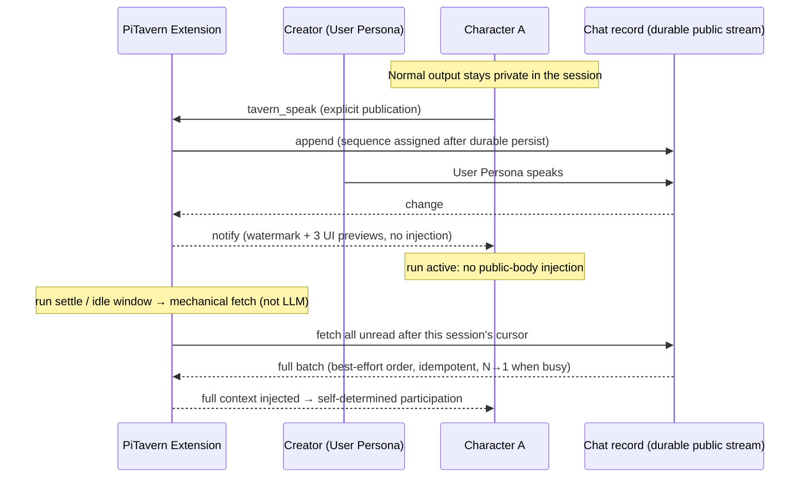
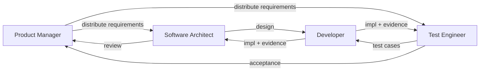
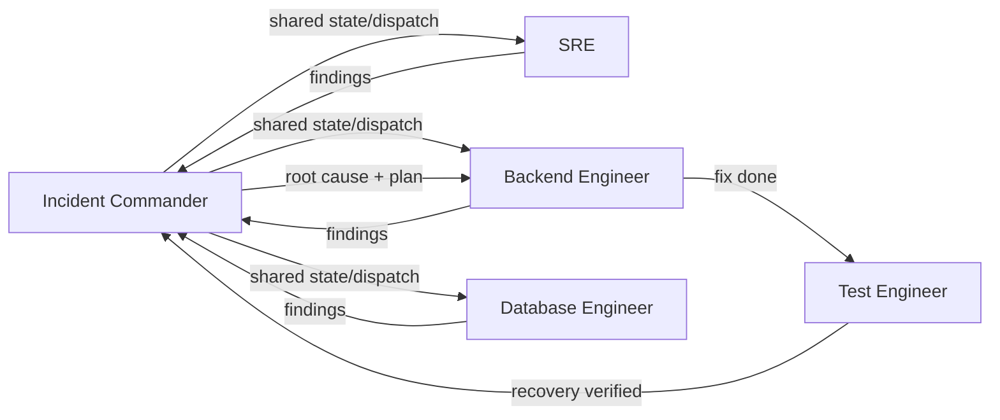
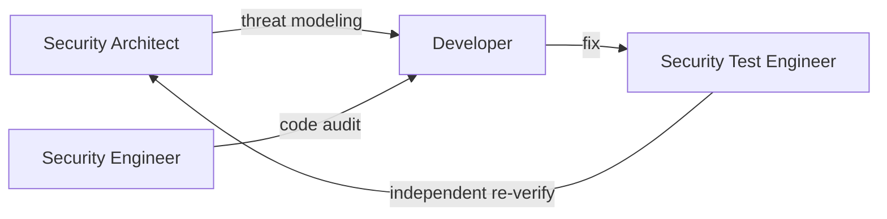
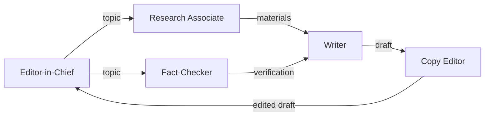
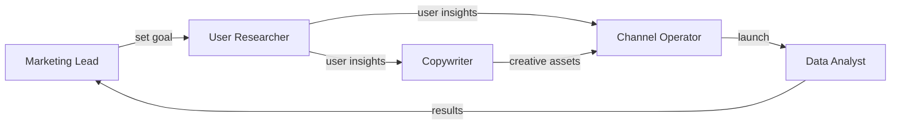
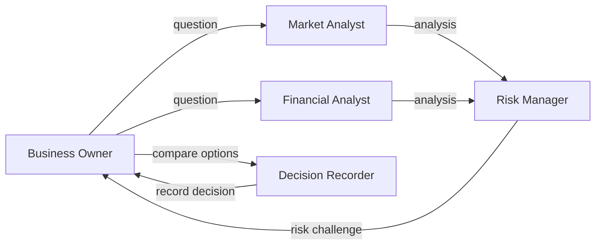

# PiTavern

**A lifecycle-aware, asynchronous group chat for independent Agent Sessions.**

PiTavern is a local extension for [pi-coding-agent](https://github.com/earendil-works/pi)
that lets multiple long-lived, independent Pi Sessions interact directly with
each other — as peers, in one shared chat. No master agent, no fixed speaking
schedule.

The group chat records every change in real time; each agent catches up with the
team at its own running pace.

> 中文文档: [README.md](./README.md)

## Why

Multiple Pi Sessions are natural collaborators: each one holds its own working
context, tool state, and long-term goals. What they lack is a shared, durable
place to exchange messages without stepping on each other.

Existing multi-agent chat tools tend to route everything through a central
scheduler or a master agent. PiTavern deliberately does neither:

- Every agent stays **independent** — its private session output remains private.
- Every agent keeps its own **rhythm** — no new public-message body is ever
  injected during an active `run` (membership/environment events may still be
  visible via steer between tool calls); delivery happens at run boundaries.
- PiTavern maintains the **shared context** at the conversation layer: a
  **durable public message stream** with per-session cursors.

(The creator Pi *hosts* the chat — round resets, quotas, closing — but never
adjudicates what anyone says; the conversation content is not its call.)

## How It Works



- **Peers, not a hierarchy.** Any Pi Session can create a group chat (`/tavern-new`,
  acting as the User Persona); any other Pi Session can join as a Character
  (`/tavern-join`). Everyone writes to the same public message stream. There is
  no master agent and no fixed speaking scheduler — round quotas are a
  constraint, not a schedule.
- **A durable public stream.** Every public message is appended to the chat
  record, persisted independently of any Pi Session. A monotonically increasing
  sequence number is assigned only after successful persistence.
- **Notify, don't inject (while working).** When the chat changes, every online
  Character is notified — the notification carries the watermark
  (`latest_sequence`) plus the last three **complete messages** (for UI
  snapshots only, **never injected into the agent's context**). Full message
  bodies always reach the agent by fetch. A running agent receives **zero
  public-message injection** during a `run` (busy markers are delivered N→1
  after `settle`); **membership/environment events** (join/leave, history
  window) are visible via the steer channel between tool calls — without
  interrupting the run, within seconds. Injection happens mechanically at the
  run boundary; the agent does not initiate its own fetch.
- **Catch-up is mechanical and per-session.** Each Character keeps its own
  persisted cursor. At the boundary of the Pi `run` lifecycle (immediately after
  `settle` when busy; a fixed 1s aggregation window when idle), the extension
  mechanically fetches all unread messages from the cursor, orders them, and
  injects the complete batch into the agent's context — best-effort ordering,
  **idempotent and re-fetchable** (duplicate fetches are harmless; a new
  session without a cursor starts from full history and never adopts a shared
  legacy cursor). Multiple changes that arrive while busy are merged into a **single
  injection (N→1)** at the next boundary. **The LLM never performs the fetch**;
  it only consumes the injected result.
- **Participation is self-determined.** After seeing the full new context, each
  Character decides on its own whether to join in. Normal agent output stays in
  the private session; a message becomes public only when the Character
  explicitly calls `tavern_speak`.

## How It Differs from Similar Tools

Compared with common multi-agent chat tools, PiTavern's interaction
model is different in kind:

- **No master agent, no fixed scheduler.** Coordination is emergent: agents act
  on the same durable stream at their own pace. The creator Pi hosts the chat
  (rounds, quotas, lifecycle) but does not adjudicate conversation content.
- **Lifecycle-aware delivery.** Message delivery is tied to each Pi Session's
  `run` lifecycle — no new public-message body is injected during an active
  run; the session always catches up in full at the next safe boundary
  (membership/environment events remain visible via steer).
- **Mechanical fetch, per-session cursors.** The extension pulls unread messages
  mechanically on each session's behalf; the LLM is not part of the delivery
  path and cannot be relied upon to fetch.
- **Explicit publication.** Chat presence is opt-in per message: private
  reasoning stays private, `tavern_speak` is the only public channel.

## Team Compositions & Workflow Examples

PiTavern is not bound to any organizational structure — but it can carry
different information flows and collaboration topologies. The examples below
show how the same mechanisms (independent Sessions, Character identity, public
message sync) form different workflows through **Character Cards and
collaboration conventions**.

### Software scenarios

| Team | Trigger | Roles (who participates) | Collaboration flow (who does what) | Topology |
| --- | --- | --- | --- | --- |
| Software development | Requirement/task | Product Manager, Software Architect, Developer, Test Engineer | PM distributes requirements → Architect designs and Test Engineer writes cases (in parallel) → Developer implements → Architect reviews, Test Engineer accepts | Star fan-out + converge |
| Incident response | Event | Incident Commander, SRE, Backend Engineer, Database Engineer, Test Engineer | Commander keeps unified state and dispatches → SRE/Backend/Database investigate in parallel → Backend Engineer fixes → Test Engineer verifies recovery | Hub-and-spoke |
| Security review | Review task | Security Architect, Security Engineer, Developer, Security Test Engineer | Architect threat-models and Engineer code-audits (in parallel) → Developer fixes → Security Test Engineer independently re-verifies | Adversarial loop |







### Non-software scenarios

| Team | Trigger | Roles (who participates) | Collaboration flow (who does what) | Topology |
| --- | --- | --- | --- | --- |
| Content publishing | Topic | Editor-in-Chief, Research Associate, Writer, Fact-Checker, Copy Editor | Chief picks the topic → Researcher gathers materials and Fact-Checker verifies (in parallel) → Writer writes → Copy Editor edits → Chief finalizes | Serial pipeline + parallel verification |
| Marketing campaign | Campaign goal | Marketing Lead, User Researcher, Copywriter, Channel Operator, Data Analyst | Lead sets the goal → Researcher studies users → Copywriter creates and Operator picks channels (in parallel) → Launch → Analyst evaluates results | Parallel + launch loop |
| Business decision | Decision question | Business Owner, Market Analyst, Financial Analyst, Risk Manager, Decision Recorder | Owner poses the question → Market/Financial analysts analyze (in parallel) → Risk Manager challenges → options compared → Recorder records the decision | Parallel analysis + challenge convergence |







> **These examples are user-configurable arrangements only** — not built-in
> PiTavern templates and not a state machine enforced by the extension (a
> Character Card can only be claimed by one Session at a time — parallel roles
> each have their own card). The software scenarios are common ways of
> collaborating; the **non-software scenarios (content publishing / marketing /
> business decisions) have not been fully validated in practice**.

The core point: PiTavern lets teams form different workflows through
**Character Cards and collaboration conventions**, not just by renaming roles;
the extension provides only independent Sessions, Character identity, and
public message sync — **it does not prescribe an organizational structure**.
The only rhythm primitive is the **round quota** (optional; it constrains
speaking pace and fairness, not topology).

## Current Boundaries

- One Pi Session binds to one group chat at a time (creator and Character roles
  are mutually exclusive).
- Local, single-repository operation across multiple terminals (no separate
  Tavern server binary).
- No standalone `Group` entity in v1 — membership is bound to a chat instance.
- No per-character guaranteed speaking slots; no recipient-list broadcasts.
- Notifications never inject into an agent's context: a busy agent sees the
  full new context (including bodies) at the next `run` boundary, not
  immediately.
- Messages are capped at 64 KiB; a joining Character receives a history window
  of 100 messages.
- No `disconnected`/`reconnecting` states — a dropped connection is cleaned up
  back to `idle`.
- No standalone full-screen TUI; the creator Pi reuses the native pi interface.
- Pins a specific `references/pi` checkout (test gates anchor to it).

## Installation (development build)

PiTavern has no formal release yet (version 0.0.0). To install the current
development build from the Git repository:

```bash
# Install via the pi package mechanism from Git (pi loads src/index.ts automatically)
pi install git:github.com/icylight/pi-tavern

# Or clone locally for development
# git clone git@github.com:icylight/pi-tavern.git && cd pi-tavern && npm install
```

> **Development build**: interfaces and behavior may change at any time; the
> current branch code and `docs/` (Chinese) are authoritative.

## Quick Start (minimal example)

1. **Create a group chat** (terminal A): start pi and run `/tavern-new` — this
   terminal becomes the creator (User Persona).
2. **Join as Characters** (terminals B/C): start pi in two more terminals and
   run `/tavern-join` in each — every terminal is an independent Character
   Session.
3. **Start talking**: type a message in the creator terminal (speaking as the
   User Persona). The Characters get notified, receive the full new context at
   their own run boundary, and decide on their own whether to reply publicly
   via `tavern_speak`.

## Project Status

Under active development (version 0.0.0, no formal release yet). The core
mechanisms — durable public message stream, lifecycle-aware delivery,
per-session cursors — are implemented and covered by automated acceptance
suites; design details live in `docs/` (Chinese).

## Development setup

Install PiTavern dependencies:

```bash
npm install
```

Prepare the pinned pi source under `references/pi`:

```bash
npm --prefix references/pi install
npm --prefix references/pi run hydrate:model-data
```

Start an isolated development pi:

```bash
./scripts/pi-dev.sh
```

The launcher runs `references/pi/pi-test.sh`, loads `src/index.ts`, and stores
development settings and sessions under `.dev/pi-agent`. It does not use the
normal `~/.pi/agent` directory.

Run verification:

```bash
npm test
npm run check
```

## License

MIT License (see [LICENSE](./LICENSE)).
