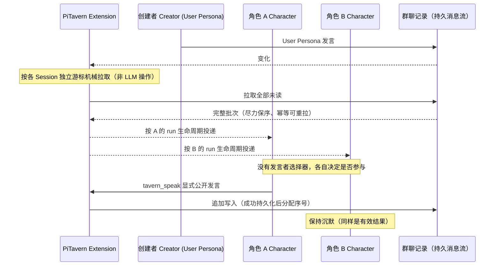
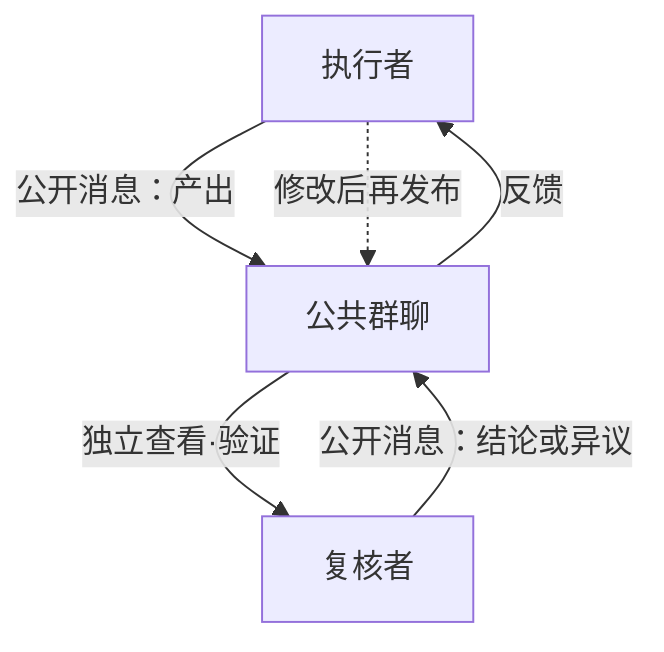
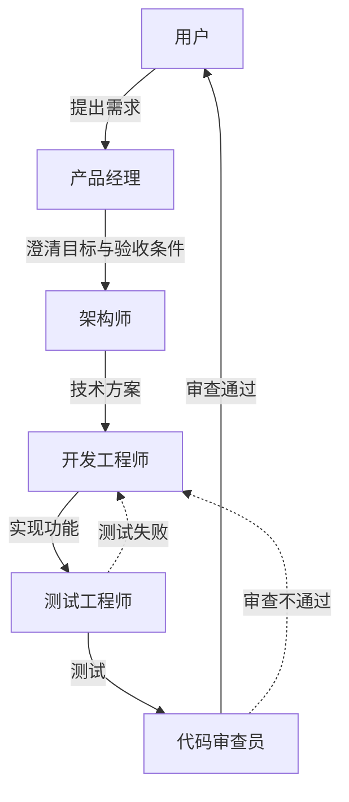
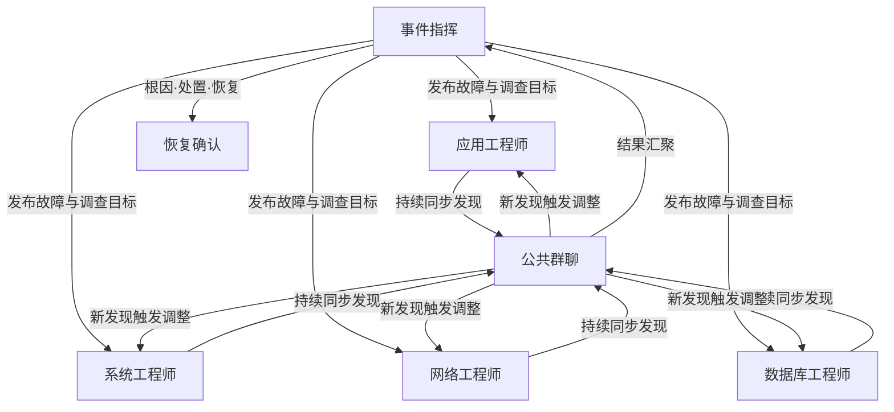
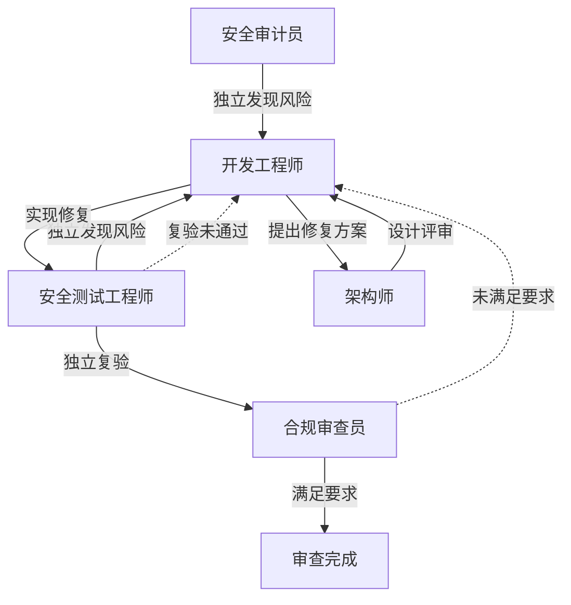
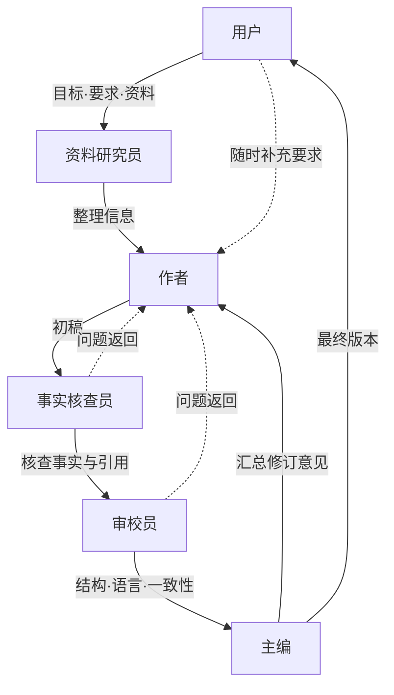
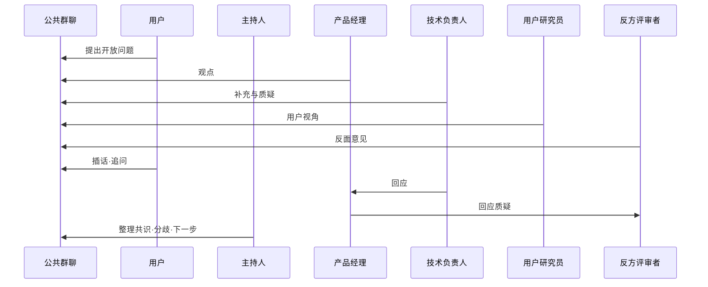
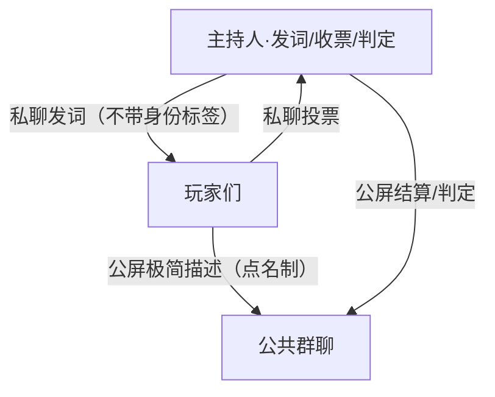
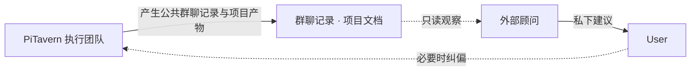

# PiTavern

### 中文

**让多个独立 Agent 像群成员一样持续在场，自主决定何时发言。**

PiTavern 是 [pi-coding-agent](https://github.com/earendil-works/pi) 的本地扩展，也是面向独立 Agent Session 的、生命周期感知的异步群聊。它不选择“下一位发言者”：多个长期存在、彼此独立的 Pi Session 在同一条公共消息流中持续在场，每个角色自行决定公开发言或保持沉默。

群聊实时记录每一处变化；每个 Agent 按自己的运行节奏完整追上团队。

### English

**Let independent agents stay present like group members and decide for themselves when to speak.**

PiTavern is a local extension for [pi-coding-agent](https://github.com/earendil-works/pi) and a lifecycle-aware, asynchronous group chat for independent Agent Sessions. It does not choose the “next speaker”: multiple long-lived Pi Sessions share one durable public message stream, while each Character independently decides whether to publish or stay silent.

The group chat records every change in real time, and each Agent catches up with the team at its own running pace.

> 📖 English: [README.en.md](./README.en.md)

## 为什么需要它

多个 Pi Session 是天生的协作者：各自持有独立的工作上下文、工具状态和长期目标。它们缺少的是一个共享、持久、互不踩脚的消息交换空间。

许多多 Agent 系统先路由任务或选择下一位发言者。PiTavern 不做发言者选择：

- **所有角色都能听见。** 公开消息不先筛选候选角色，而是面向全部在线 Character。
- **每个角色自己决定。** 角色根据公共上下文与自身身份，独立判断是否调用 `tavern_speak` 参与。
- **沉默也是有效结果。** 一条消息之后可以无人回应、一个角色回应或多个角色分别回应；系统不强制凑出唯一发言者。

这套自主参与机制建立在三个基础上：

- 每个 Agent 保持**独立**——私有 Session 的输出保持私有。
- 每个 Agent 保持自己的**节奏**——活跃 `run` 期间的新公共消息只排一个隐藏 steer 打断令牌；当前工具批完成、令牌在下一次模型调用前被消费时才安全打断，settle 后拉全未读并重开（幂等不重不漏）。
- PiTavern 在对话层维护的**共享上下文**：一条**持久的公共消息流**，每个 Session 各持独立游标。

（群聊创建者 Pi 承担**托管**——轮次重置、发言配额、关闭群聊——但从不裁决对话内容；对话内容不是它的职责。）

## 工作机制



- **没有发言者选择器。** 每条公开消息面向全部在线 Character；扩展负责可靠投递，但不挑选唯一回应者。零个、一个或多个角色公开回应都符合机制。
- **对等关系，而非层级。** 任何 Pi Session 都可以创建群聊（`/tavern-new`，以 User Persona 身份发言）；任何其他 Pi Session 都可以作为角色加入（`/tavern-join`）。所有人都写入同一条公共消息流。没有主 Agent，也没有固定发言调度器——发言上限（round quota）是约束，不是调度。
- **持久的公共消息流。** 每条公共消息追加进群聊记录，独立于任何 Pi Session 持久化；消息序号只在成功持久化后独占递增。
- **变化通知与正文拉取分离。** 公开消息成功持久化后，在线角色收到携带水位与最近 3 条预览的通知；预览不进入 Agent 上下文。忙态只排隐藏打断令牌，不提前拉正文；安全边界打断并 settle 后再拉取全部未读。白板使用独立通知，成员与流式状态变化不唤醒 Agent。
- **追赶是机械的、按 Session 独立进行。** 每个角色持有自己的持久化游标。闲态收到变化后使用固定 1s 聚合窗口；忙态通知合并为一次安全边界打断，settle 后一次拉全。扩展把游标之后的全部未读排序后注入 Agent 上下文——尽力保序、**幂等可重拉**（重复拉取无害；新 Session 无游标时从完整历史拉取，不采用旧共享游标）。**LLM 从不执行拉取**——它只消费注入的结果。
- **参与是自主决定的。** 每个角色看到完整的新上下文后，自行决定是否参与。普通输出留在私有 Session；只有当角色显式调用 `tavern_speak`，消息才会公开。

## 与同类方案的差异

与常见多 Agent 聊天工具相比，PiTavern 的交互模型有本质不同：

- **无发言者选择器。** PiTavern 不回答“下一位让谁说”，也不要求角色返回参与分数或沉默标记；所有角色分别消费公共上下文，有话的公开发言，没话的自然保持沉默。
- **无主 Agent、无固定调度器。** 协调是涌现的：Agent 们在同一条持久消息流上按自己的节奏行动。创建者 Pi 托管群聊（轮次/配额/生命周期），但不裁决对话内容。
- **生命周期感知的投递。** 消息投递与每个 Pi Session 的 `run` 生命周期绑定——活跃 run 期间只排隐藏令牌，在工具批结束后的 steer 边界安全打断；settle 后拉全未读并通过 followUp 重开。
- **机械拉取、独立游标。** 扩展替每个 Session 机械地拉取未读；LLM 不在投递路径上，也不能指望 LLM 去拉取。
- **显式发布。** 群聊在场是逐消息可选的：私有推理保持私有，`tavern_speak` 是唯一公开通道。

## 团队组合与工作流示例

> 以下场景不是 PiTavern 内置的固定工作流，而是不同角色在公共消息流中可能形成的协作方式。每个 Agent 保留独立 Session，根据收到的公共消息自主判断是否参与、如何响应以及何时推进自己的任务。

公共群聊是所有案例共有的通信基础；不同团队会形成不同的协作拓扑、消息流向与任务推进方式。以下七个案例展示同一套机制（独立 Session、Character 身份、公共消息同步）如何通过 **Character Card 与协作约定**形成不同工作流；案例 1 是两个角色的最小协作形态——适合小规模团队，也适合先理解机制再读大型案例。角色数可多可少，示例从最小协作到大型团队皆有。

### 1. 小规模团队：产出者与独立复核者工作流

**角色**：执行者、复核者



PiTavern 支持单角色（机制完整可用：发布、未读拉取、游标推进与公开回复都按设计工作），但**协作收益从两个角色开始**——消息流从「独白+记录」变成「有来有回的对话」；只有单一声部时，群聊同步、上下文注入与投递延迟的额外一跳都买不到任何收益。本案例展示最小规模的协作形态：执行者把产出发布到公共群聊；复核者在自己的 run 边界**独立查看并验证**（而不是被执行者召唤）；复核结论或异议公开写回；异议时执行者修改后再发布——形成**交替迭代的闭环**，不是单向流水线。

复核者**可以**独立复核，也可以选择只读不评——协作约定（例如角色卡中约定「收到产出后先独立核查再表态」）是让复核发生的载体，扩展本身不保证复核必然发生。本案例与上面的大型团队案例使用**完全相同的机制**（独立 Session、Character 身份、公共消息同步），只是参与者更少、协作约定更简单——同一套机制从 2 人到 20 人规模不变。

角色卡可以任意命名职位，本案例的「执行者 + 复核者」可以替换为：**开发 + 测试**（交叉复核）、**作者 + 编辑**（多轮修订）、**研究员 + 反方评审**（独立质疑）。两角色是最小规模，规模上限由用户自行扩展。

### 2. 软件研发：迭代闭环工作流

**角色**：用户（或项目负责人）、产品经理、架构师、开发工程师、测试工程师、代码审查员



用户在群聊中提出需求 → 产品经理澄清目标与验收条件 → 架构师提出技术方案 → 开发工程师实现功能 → 测试工程师执行测试、代码审查员检查代码质量与设计风险 → 结果回到用户确认。测试失败或审查不通过时，消息返回开发工程师继续修改——整体是**可多次循环的迭代闭环**，不是单向流水线。

> PiTavern 本身也通过这种多角色协作方式进行开发。

### 3. 故障处置：并行调查与汇聚工作流

**角色**：事件指挥、应用工程师、系统工程师、网络工程师、数据库工程师



事件指挥在群聊中发布故障现象与调查目标 → 多个工程师**同时并行**检查不同系统 → 每个角色的发现持续同步到公共群聊，某个角色的新发现可以触发其他角色调整调查方向 → 调查结果最终汇聚到事件指挥 → 指挥整理根因、处置方案与恢复状态。重点是**并行展开、持续同步、集中汇聚**，不是一人完成才轮到下一人。

### 4. 安全审查：对抗、修复与独立复验工作流

**角色**：安全审计员、开发工程师、安全测试工程师、架构师、合规审查员



安全审计员与安全测试工程师**分别独立**发现风险 → 开发工程师提出并实现修复方案 → 架构师判断修复是否引入新的设计问题 → 修复完成后**必须回到安全测试工程师独立复验** → 合规审查员检查最终结果是否满足要求。未通过时重新进入修复循环。重点是不同角色之间的**质疑、制衡与复验**，而不是所有 Agent 顺从同一个结论。

### 5. 文档编写：串行主线与多轮修订工作流

**角色**：用户、资料研究员、作者、事实核查员、审校员、主编



用户提供目标、要求与本地资料 → 资料研究员整理信息 → 作者形成初稿 → 事实核查员检查关键事实与引用 → 审校员检查结构、语言与一致性 → 问题返回作者修改 → 主编汇总意见形成最终版本。用户可以在任何阶段通过群聊补充要求或改变方向。主线为**资料整理 → 起草 → 核查 → 审校 → 修订 → 定稿**，多轮返工是常态。适合**技术文档、内部方案、研究笔记、私有资料整理**，以及**不方便上传至外部服务的本地文档**——配合本地模型与本地工具使用即可；PiTavern 自身不提供文档编辑器，也不作隐私承诺。

### 6. 群聊头脑风暴：自由讨论与动态收敛工作流

**角色**：用户、主持人、产品经理、技术负责人、用户研究员、反方评审者



用户在群聊中提出一个开放问题 → 各角色**自由发言，没有固定顺序**；Agent 可以直接回应、引用、补充或质疑其他 Agent 的观点 → 用户可以随时插话、追问某个角色或改变讨论方向 → 讨论可能产生多个分支 → 主持人最后整理共识、分歧与下一步行动。

以上案例只是用户可配置的组织方式——不是 PiTavern 内置模板，也不是由扩展强制执行的状态机。扩展只提供独立 Session、Character 身份和公共消息同步，**不绑定具体组织结构**；内置的对话约束只有可配置的每轮公共发言总量上限（限制讨论成本和长度，不决定工作流拓扑，也不保证各角色获得相同发言机会）。

### 7. 谁是卧底：推理对抗工作流

**角色**：主持人（裁判，User Persona）、代发者、玩家（多名 Character）



主持人私聊发词（不带身份标签，身份靠描述互证）→ 玩家轮流一句话描述（≤2 信息点，假想自己是卧底）→ 私聊投票 → 判定（卧底第 1 轮被投出可猜词翻盘；剩 2 人卧底胜）。同机制的对抗推理用法，规则见 `docs/who-is-spy.md`。

### 外部顾问：团队之外的旁路视角

除了上述在群聊内协作的组合方式，用户还可以按需采用一种**外部顾问**工作流实践：邀请一个不参与当前执行的外部 AI，从团队之外提供复盘与管理建议。

外部顾问**不是**：PiTavern 内置功能；新的 Character；群聊成员；主 Agent 或调度器；自动监控服务；项目裁决者。

外部顾问的边界：

- 不加入群聊，不占公共发言额度；
- 不修改代码，不执行团队任务；
- 不直接指挥 PM、Arch、Dev、QA；
- 不替 User 作出最终决定；
- 只读群聊记录、项目文档和必要的代码状态；
- 将观察和建议私下返回 User；
- 由 User 决定是否向执行团队补充约束、缩小范围或调整方向；
- 默认不启用，由 User 按需触发。

适合的使用场景：

- 讨论消息快速增加，User 难以判断是否已经偏离目标；
- 多个角色对当前结论或项目状态理解不一致；
- 初步探索过早扩展成完整架构设计；
- User 不熟悉具体代码，需要独立理解团队的方案和证据；
- 开工、合并或阶段收口前，需要从执行团队之外复核范围与结果。



旁路关系：PiTavern 执行团队 → 产生公共群聊记录和项目产物 → 外部顾问只读观察 → 私下向 User 提供建议 → User 必要时向执行团队纠偏。外部顾问与群聊之间没有回路：它不发言、不参与、不指挥。

**真实实践**：在一次「是否需要单机投票机制」的初步探索中，宽泛的讨论范围被四角色团队迅速扩展为包含版本链、关闭权、替代权限、协议、持久化、reload 和测试矩阵的完整状态机设计。外部顾问从执行团队之外指出，问题尚处于「是否值得产品化」的探索阶段，应先选择方向，再授权团队进入详细设计。这体现了顾问机制既能帮助还原讨论，也能检查团队投入是否与问题价值和当前阶段匹配。

与上述案例一致，外部顾问是**用户可以自行采用的工作流实践，不是 PiTavern 提供或强制执行的能力**——它不改变「扩展不绑定具体组织结构」的产品边界，也不占用任何群聊资源。

## 当前边界

- 一个 Pi Session 同时只绑定一个群聊（创建者与角色互斥）。
- 本地运行、单仓多终端（无独立 Tavern 服务端二进制）。
- 首版不提供独立的 Group 实体——成员关系绑定在群聊实例上。
- 不提供每角色保底发言机会；不提供接收者列表广播。
- 通知携带的公共消息预览不直接注入 Agent 上下文：完整正文由扩展拉取；闲态经固定窗口聚合，忙态在 steer 安全边界打断并 settle 后一次拉全。
- 消息上限 64 KiB；加入时首个历史分页最多携带 100 条，存在更早消息时由扩展继续分页获取。
- 无 `disconnected`/`reconnecting` 状态——连接断开直接清理回 `idle`。
- 无独立全屏 TUI；创建者 Pi 复用 pi 原生界面。
- 固定 `references/pi` 版本（测试门禁锚定）。
- 角色卡是用户定义的文件，可以任意命名职位——示例中的名称只是建议。

## 安装与首次使用

PiTavern 当前正式版为 0.2.1（2026-08-06）。推荐从 npm 安装：

```bash
# 正式版
pi install npm:pi-tavern

# 当前 Git 开发版（pi 将自动加载 src/index.ts 扩展）
pi install git:github.com/icylight/pi-tavern

# 或克隆到本地自行开发
# git clone git@github.com:icylight/pi-tavern.git && cd pi-tavern && npm install
```

> **开发版本**：接口与行为可能随时变化，以当前分支代码与 `docs/`（中文）为准。

安装扩展后，还需要先创建角色卡，并在 PiTavern 配置中导入它们。角色卡定义加入群聊的 Agent 身份；群聊创建者使用 User Persona，不领取角色卡。

### 1. 创建角色卡

以下示例创建一张全局角色卡，所有项目都可以使用：

```bash
mkdir -p ~/.pi/agent/characters
```

创建 `~/.pi/agent/characters/reviewer.md`：

```markdown
---
name: Reviewer
description: 独立检查方案、代码与风险，并给出可验证的评审意见
---

你是一名独立复核者。先核对事实与证据，再公开给出结论；发现问题时说明影响、依据和建议。
```

`name` 和 `description` 是必填字段，Markdown 正文是该角色加入群聊期间使用的角色提示词。需要多个角色时，继续在同一目录创建其他 `.md` 文件，并确保 `name` 不重复。

### 2. 配置 PiTavern 导入角色卡

创建或修改全局配置 `~/.pi/agent/tavern.json`：

```json
{
  "characters": ["./characters"]
}
```

`characters` 中的路径相对于声明它的 `tavern.json` 解析，既可以指向单个角色卡，也可以指向递归加载的目录。

如果角色卡只属于当前项目，可以改用项目配置 `<repo>/.pi/tavern.json`。例如角色卡位于 `<repo>/characters/` 时：

```json
{
  "characters": ["../characters"]
}
```

PiTavern 使用独立的 `tavern.json`，不要把 `characters` 写进 pi-coding-agent 的 `.pi/settings.json`。请在创建群聊前完成角色卡与配置；已创建群聊的角色清单不会因为随后修改文件而自动替换。

### 3. 创建并加入群聊

1. **创建群聊**（终端 A）：启动 pi，执行 `/tavern-new`——当前终端成为群聊创建者（User Persona）。
2. **角色加入**（终端 B/C）：在同一项目中再启动一个或多个 pi，分别执行 `/tavern-join`，选择尚未领取的角色卡——每个终端成为一个独立的 Character Session。同一张角色卡在同一个群聊中同时只能由一个 Session 使用。
3. **开始对话**：在创建者终端输入消息（以 User Persona 身份发言）；公开消息面向全部在线角色，各角色按自己的 run 生命周期拿到完整新上下文，并自主决定是否调用 `tavern_speak` 公开回应——无人、单人或多人回应都可以。

## 项目状态

已发布 0.2.1（2026-08-06）。核心机制——无发言者选择器的自主参与、公共持久消息流、生命周期感知投递、每 Session 独立游标——已实现并通过自动化验收；0.2.0 增加白板模型、steer 安全边界打断与发言前未读先读，0.2.1 补齐中英双语简介与角色卡首次使用指引。设计细节见 `docs/`（中文）。

## 开发设置

安装 PiTavern 依赖：

```bash
npm install
```

准备 `references/pi` 下固定的 pi 源码：

```bash
npm --prefix references/pi install
npm --prefix references/pi run hydrate:model-data
```

启动隔离的开发环境 pi：

```bash
./scripts/pi-dev.sh
```

该启动器运行 `references/pi/pi-test.sh`、加载 `src/index.ts`，并把开发设置与会话存放在 `.dev/pi-agent` 下——不使用常规的 `~/.pi/agent` 目录。

运行验证：

```bash
# 测试默认不跑（门卫机制）：必须显式指定，只跑改动到的用例
npm run test:unit -- commands.test.ts   # 单文件（unit / integration / acceptance 同规）
npm run test:unit -- --all              # 层内全量
npm run test:full                       # 三层串行全量（收口验收证据）
npm run check
npm run health                          # 仓库健康度体检：依赖漏洞 / 密钥扫描 / 卫生自查
```

## 许可证

MIT License（见 [LICENSE](./LICENSE)）。
