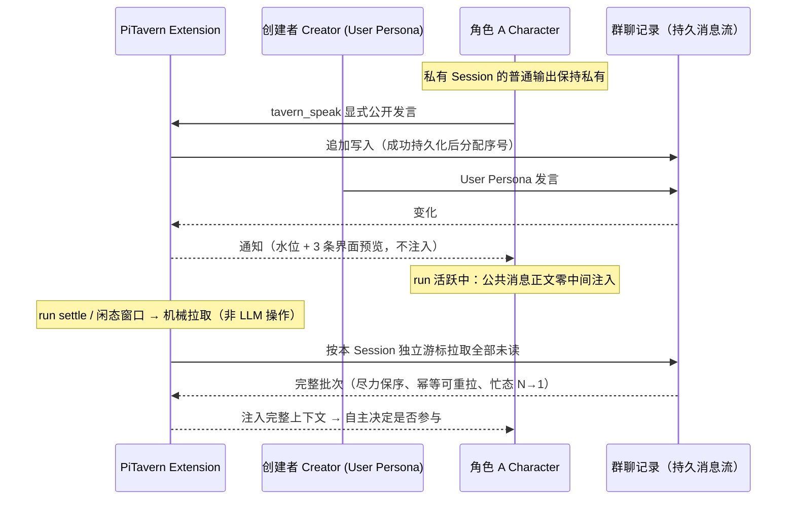
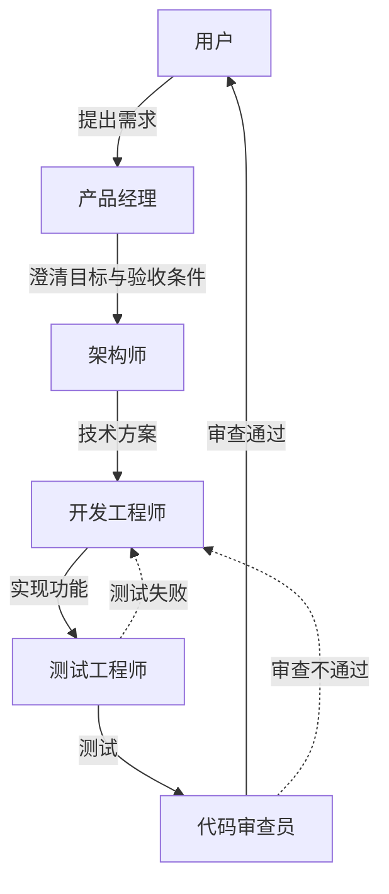
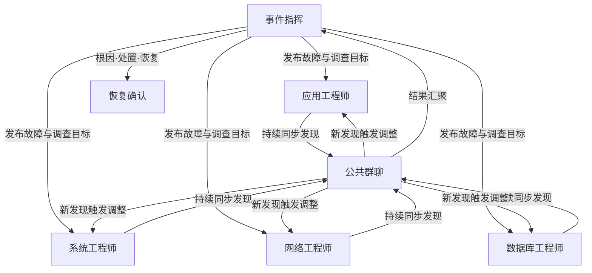
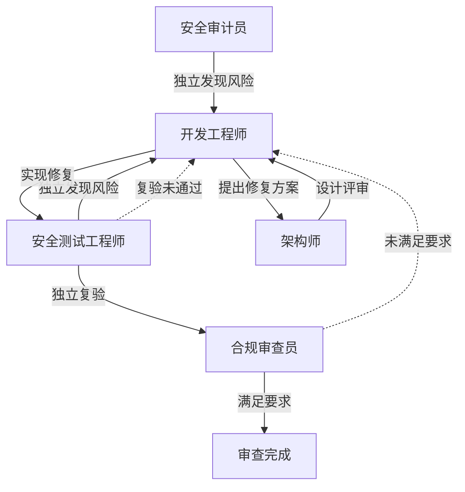
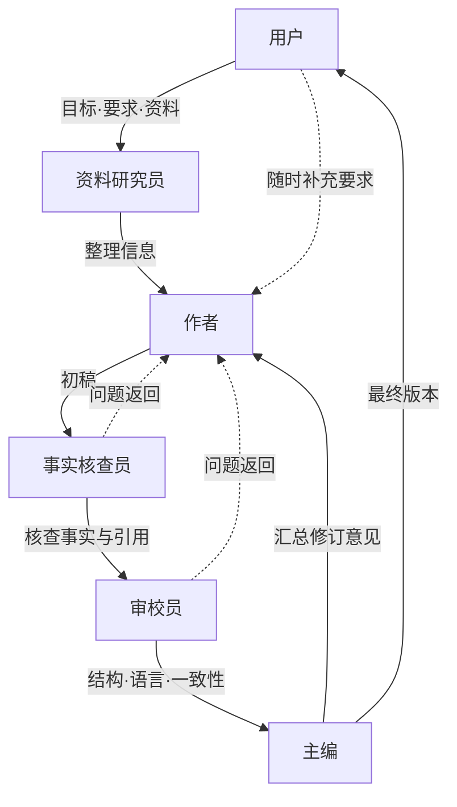
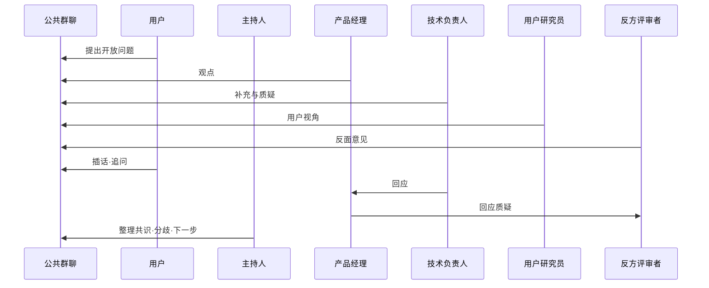

# PiTavern

**面向独立 Agent Session 的、生命周期感知的异步群聊。**

PiTavern 是 [pi-coding-agent](https://github.com/earendil-works/pi) 的本地扩展，让多个长期存在、彼此独立的 Pi Session 在同一个共享群聊中直接交互——彼此对等，不设主 Agent，也没有固定的发言调度。

群聊实时记录每一处变化；每个 Agent 按自己的运行节奏完整追上团队。

> 📖 English: [README.en.md](./README.en.md)

## 为什么需要它

多个 Pi Session 是天生的协作者：各自持有独立的工作上下文、工具状态和长期目标。它们缺少的是一个共享、持久、互不踩脚的消息交换空间。

常见的多 Agent 聊天工具倾向于让一个中央调度器或主 Agent 路由一切。PiTavern 两者都不做：

- 每个 Agent 保持**独立**——私有 Session 的输出保持私有。
- 每个 Agent 保持自己的**节奏**——活跃 `run` 期间新公共消息经 steer 通道在工具调用间隙可见（不打断 run、秒级），settle 时补拉全整批追上（幂等不重不漏）。
- PiTavern 在对话层维护的**共享上下文**：一条**持久的公共消息流**，每个 Session 各持独立游标。

（群聊创建者 Pi 承担**托管**——轮次重置、发言配额、关闭群聊——但从不裁决对话内容；对话内容不是它的职责。）

## 工作机制



- **对等关系，而非层级。** 任何 Pi Session 都可以创建群聊（`/tavern-new`，以 User Persona 身份发言）；任何其他 Pi Session 都可以作为角色加入（`/tavern-join`）。所有人都写入同一条公共消息流。没有主 Agent，也没有固定发言调度器——发言上限（round quota）是约束，不是调度。
- **持久的公共消息流。** 每条公共消息追加进群聊记录，独立于任何 Pi Session 持久化；消息序号只在成功持久化后独占递增。
- **通知，但不注入（工作中零注入）。** 群聊发生变化时，所有在线角色都会收到通知——通知携带水位（latest_sequence）与最近 3 条**完整消息**（仅界面快照用，**不注入 Agent 上下文**）；Agent 收到的完整正文一律经拉取获得。运行中的 Agent 在 `run` 期间**公共消息正文零注入**（忙态标记 → settle 后 N→1 注入）；**成员/环境事件**（角色加入/离开、历史窗口）经 steer 通道在工具调用间隙可见——不打断 run、秒级延迟。注入由扩展在 run 边界机械完成，Agent 不自行发起拉取。
- **追赶是机械的、按 Session 独立进行。** 每个角色持有自己的持久化游标。在 Pi `run` 生命周期的边界上（忙态：settle 后立即；闲态：固定 1s 聚合窗口），扩展机械地拉取游标之后的全部未读消息，排序后把完整批次注入 Agent 上下文——尽力保序、**幂等可重拉**（重复拉取无害；新 Session 无游标时从完整历史拉取，不采用旧共享游标）。忙态期间到达的多条变化合并为**单次注入（N→1）**。**LLM 从不执行拉取**——它只消费注入的结果。
- **参与是自主决定的。** 每个角色看到完整的新上下文后，自行决定是否参与。普通输出留在私有 Session；只有当角色显式调用 `tavern_speak`，消息才会公开。

## 与同类方案的差异

与常见多 Agent 聊天工具相比，PiTavern 的交互模型有本质不同：

- **无主 Agent、无固定调度器。** 协调是涌现的：Agent 们在同一条持久消息流上按自己的节奏行动。创建者 Pi 托管群聊（轮次/配额/生命周期），但不裁决对话内容。
- **生命周期感知的投递。** 消息投递与每个 Pi Session 的 `run` 生命周期绑定——活跃 run 期间新消息立即拉取并经 steer 通道在工具调用间隙可见（秒级），settle 时补拉全（幂等）。
- **机械拉取、独立游标。** 扩展替每个 Session 机械地拉取未读；LLM 不在投递路径上，也不能指望 LLM 去拉取。
- **显式发布。** 群聊在场是逐消息可选的：私有推理保持私有，`tavern_speak` 是唯一公开通道。

## 团队组合与工作流示例

> 以下场景不是 PiTavern 内置的固定工作流，而是不同角色在公共消息流中可能形成的协作方式。每个 Agent 保留独立 Session，根据收到的公共消息自主判断是否参与、如何响应以及何时推进自己的任务。

公共群聊是所有案例共有的通信基础；不同团队会形成不同的协作拓扑、消息流向与任务推进方式。以下五个案例展示同一套机制（独立 Session、Character 身份、公共消息同步）如何通过 **Character Card 与协作约定**形成不同工作流。

### 1. 软件研发：迭代闭环工作流

**角色**：用户（或项目负责人）、产品经理、架构师、开发工程师、测试工程师、代码审查员



用户在群聊中提出需求 → 产品经理澄清目标与验收条件 → 架构师提出技术方案 → 开发工程师实现功能 → 测试工程师执行测试、代码审查员检查代码质量与设计风险 → 结果回到用户确认。测试失败或审查不通过时，消息返回开发工程师继续修改——整体是**可多次循环的迭代闭环**，不是单向流水线。

> PiTavern 本身也通过这种多角色协作方式进行开发。

### 2. 故障处置：并行调查与汇聚工作流

**角色**：事件指挥、应用工程师、系统工程师、网络工程师、数据库工程师



事件指挥在群聊中发布故障现象与调查目标 → 多个工程师**同时并行**检查不同系统 → 每个角色的发现持续同步到公共群聊，某个角色的新发现可以触发其他角色调整调查方向 → 调查结果最终汇聚到事件指挥 → 指挥整理根因、处置方案与恢复状态。重点是**并行展开、持续同步、集中汇聚**，不是一人完成才轮到下一人。

### 3. 安全审查：对抗、修复与独立复验工作流

**角色**：安全审计员、开发工程师、安全测试工程师、架构师、合规审查员



安全审计员与安全测试工程师**分别独立**发现风险 → 开发工程师提出并实现修复方案 → 架构师判断修复是否引入新的设计问题 → 修复完成后**必须回到安全测试工程师独立复验** → 合规审查员检查最终结果是否满足要求。未通过时重新进入修复循环。重点是不同角色之间的**质疑、制衡与复验**，而不是所有 Agent 顺从同一个结论。

### 4. 文档编写：串行主线与多轮修订工作流

**角色**：用户、资料研究员、作者、事实核查员、审校员、主编



用户提供目标、要求与本地资料 → 资料研究员整理信息 → 作者形成初稿 → 事实核查员检查关键事实与引用 → 审校员检查结构、语言与一致性 → 问题返回作者修改 → 主编汇总意见形成最终版本。用户可以在任何阶段通过群聊补充要求或改变方向。主线为**资料整理 → 起草 → 核查 → 审校 → 修订 → 定稿**，多轮返工是常态。适合**技术文档、内部方案、研究笔记、私有资料整理**，以及**不方便上传至外部服务的本地文档**——配合本地模型与本地工具使用即可；PiTavern 自身不提供文档编辑器，也不作隐私承诺。

### 5. 群聊头脑风暴：自由讨论与动态收敛工作流

**角色**：用户、主持人、产品经理、技术负责人、用户研究员、反方评审者



用户在群聊中提出一个开放问题 → 各角色**自由发言，没有固定顺序**；Agent 可以直接回应、引用、补充或质疑其他 Agent 的观点 → 用户可以随时插话、追问某个角色或改变讨论方向 → 讨论可能产生多个分支 → 主持人最后整理共识、分歧与下一步行动。

以上案例只是用户可配置的组织方式——不是 PiTavern 内置模板，也不是由扩展强制执行的状态机。扩展只提供独立 Session、Character 身份和公共消息同步，**不绑定具体组织结构**；内置的对话约束只有可配置的每轮公共发言总量上限（限制讨论成本和长度，不决定工作流拓扑，也不保证各角色获得相同发言机会）。

## 当前边界

- 一个 Pi Session 同时只绑定一个群聊（创建者与角色互斥）。
- 本地运行、单仓多终端（无独立 Tavern 服务端二进制）。
- 首版不提供独立的 Group 实体——成员关系绑定在群聊实例上。
- 不提供每角色保底发言机会；不提供接收者列表广播。
- 通知携带的公共消息预览不注入 Agent 上下文：公共消息正文闲态在 run 边界批量进入、忙态经 steer 在工具调用间隙可见；成员和环境事件同样经 steer 通道。
- 消息上限 64 KiB；加入时首个历史分页最多携带 100 条，存在更早消息时由扩展继续分页获取。
- 无 `disconnected`/`reconnecting` 状态——连接断开直接清理回 `idle`。
- 无独立全屏 TUI；创建者 Pi 复用 pi 原生界面。
- 固定 `references/pi` 版本（测试门禁锚定）。
- 角色卡是用户定义的文件，可以任意命名职位——示例中的名称只是建议。

## 安装（开发版本）

PiTavern 尚未发布正式版本（version 0.0.0）。要从当前 Git 仓库安装开发版：

```bash
# 通过 pi package 机制从 Git 安装（pi 将自动加载 src/index.ts 扩展）
pi install git:github.com/icylight/pi-tavern

# 或克隆到本地自行开发
# git clone git@github.com:icylight/pi-tavern.git && cd pi-tavern && npm install
```

> **开发版本**：接口与行为可能随时变化，以当前分支代码与 `docs/`（中文）为准。

## 快速开始（最短示例）

1. **创建群聊**（终端 A）：启动 pi，执行 `/tavern-new`——当前终端成为群聊创建者（User Persona）。
2. **角色加入**（终端 B/C）：再开两个终端启动 pi，分别执行 `/tavern-join`——每个终端是一个独立的角色（Character）Session。
3. **开始对话**：在创建者终端输入消息（以 User Persona 身份发言）；角色们收到通知，在自己的 run 边界拿到完整新上下文后，自主决定是否调用 `tavern_speak` 公开回应。

## 项目状态

开发中（version 0.0.0，尚未发布正式版本）。核心机制——公共持久消息流、生命周期感知投递、每 Session 独立游标——已实现并通过自动化验收；设计细节见 `docs/`（中文）。

## 开发设置

安装 PiTavern 依赖：

```bash
npm install
```

准备 `references/pi` 下固定的 pi 源码：

```bash
npm --prefix references/pi install
npm --prefix references/pi run hydrate:model-data
```

启动隔离的开发环境 pi：

```bash
./scripts/pi-dev.sh
```

该启动器运行 `references/pi/pi-test.sh`、加载 `src/index.ts`，并把开发设置与会话存放在 `.dev/pi-agent` 下——不使用常规的 `~/.pi/agent` 目录。

运行验证：

```bash
# 测试默认不跑（门卫机制）：必须显式指定，只跑改动到的用例
npm run test:unit -- commands.test.ts   # 单文件（unit / integration / acceptance 同规）
npm run test:unit -- --all              # 层内全量
npm run test:full                       # 三层串行全量（收口验收证据）
npm run check
```

## 许可证

MIT License（见 [LICENSE](./LICENSE)）。
