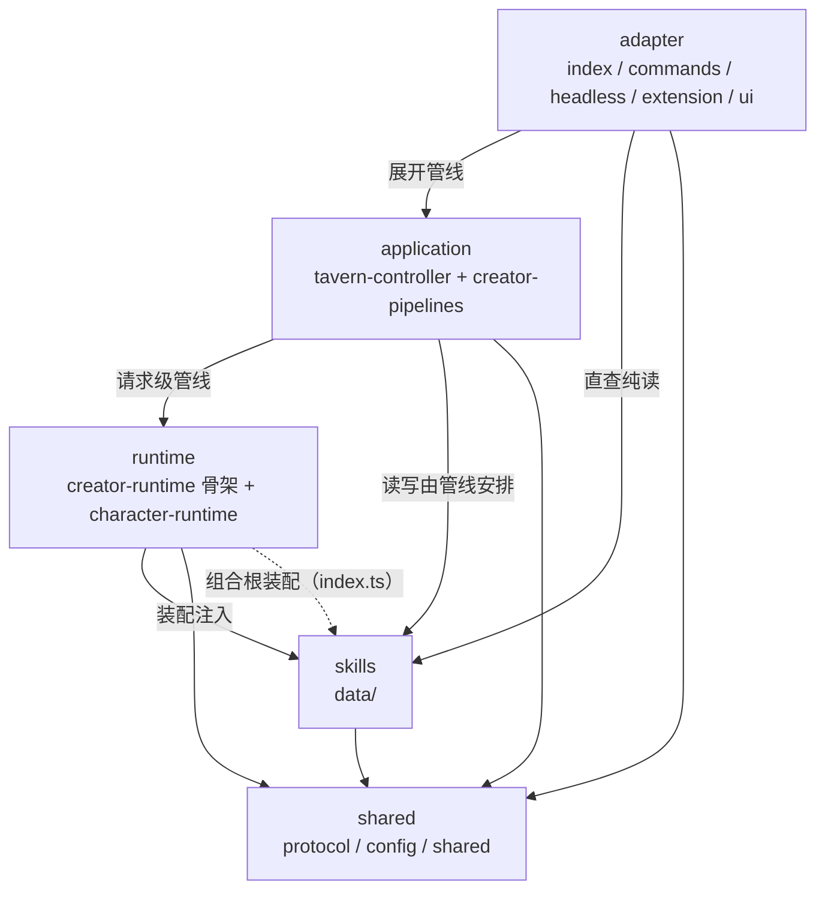

# PiTavern 架构（五层依赖图）

> 状态：**活文档**（living document，随实现演进持续更新）
> 属主：Arch（docs/adr/ 属主体系；本文件变更须群聊声明影响面）
> 关联：ADR-0005（五层架构决策，本文件为其配套依赖图与实施核注）；`npm run lint:layers`（依赖方向强制门禁）
> 更新纪律：新增/移动 src 文件、改变跨层依赖时同步更新本文件；本文件与 `lint:layers` 规则矩阵互为对照——规则矩阵是机器强制面，本文件是人读依赖图。

## 1. 五层总览

| 层 | 职责 | 落点 |
| --- | --- | --- |
| **adapter** | 薄入口：显式展开管线顺序与分支；处理结果 → 协议响应 / notify / steer | `index.ts`（组合根）/ `commands.ts` / `headless.ts` / `extension/` / `ui/` |
| **application** | 请求级 IO 管线：一次协议消息 = 一个管线实例；输入与中间 IO 收于实例字段；阶段 = 私有处理函数（Method）；读写顺序与落盘时机由主管线安排 | `controller/tavern-controller.ts` + `creator/creator-pipelines/`（7 文件） |
| **skills** | 能力单元：单一用途、一次明确读写；不编排流程、不自行决定读写时机；纯计算不隐藏 IO | `data/`（8 文件，含 `discovery/` 2 文件） |
| **runtime** | 进程单例：WS server + 连接表 + 心跳 + 能力实例装配；不保存单次任务中间状态 | `creator/`（creator-runtime 骨架 + 域模块）/ `character/`（character-runtime / join-attempt）/ `controller/reload-handoff-registry.ts` |
| **shared** | 跨进程通用契约 | `protocol/`（messages·codec·public-message-state）/ `config/` / `shared/` |



依赖单向：adapter → application → runtime → skills → shared；允许跨层依赖任意下层，禁止上行。文件 IO 仅限 skills（含豁免面，见 §5）。

## 2. 目录结构（按层标注）

```
src/
├── index.ts                  adapter·组合根（唯一装配点，豁免见 §5.3）
├── commands.ts               adapter·CLI 命令注册
├── headless.ts               adapter·headless 自动加入流程
├── extension/
│   ├── tavern-tools.ts       adapter·pi 工具注册（tavern_speak 等）
│   └── agent-lifecycle.ts    adapter·agent 生命周期事件接线
├── ui/
│   ├── tavern-ui-presenter.ts adapter·TUI 呈现
│   └── renderers.ts           adapter·TUI 渲染器注册
├── controller/
│   ├── tavern-controller.ts   application·顶层状态机（transitionTail 排队执行）
│   └── reload-handoff-registry.ts  runtime·进程级 reload 交接（#14）
├── creator/                  （混合：runtime 域为主 + application 域）
│   ├── creator-runtime.ts     runtime·骨架（427 行：构造/依赖/公开门面/生命周期）
│   ├── creator-factory.ts     runtime·装配工厂（组合根豁免，§5.2）
│   ├── connection-manager.ts  runtime·WS 连接表
│   ├── broadcast-hub.ts       runtime·通知投递（N→1 聚合，#60）
│   ├── heartbeat-registry.ts  runtime·心跳域
│   ├── member-bookkeeping.ts  runtime·成员簿记
│   ├── reload-flow.ts         runtime·reload 域
│   ├── runtime-facades.ts     runtime·公开 API 门面
│   ├── runtime-lifecycle.ts   runtime·生命周期域（含 #66 watchdog）
│   ├── ws-utils.ts            runtime·WS 工具
│   ├── pipeline-assembly.ts   runtime·装配域（管线组装）
│   └── creator-pipelines/     application·请求级管线（7 文件）
│       ├── dispatch.ts        runtime 域桥接文件（目录/域不一致，§5.4）
│       ├── submit-message-pipeline.ts  application
│       ├── join-pipeline.ts   application
│       ├── claim-pipeline.ts  application
│       ├── ready-pipeline.ts  application
│       ├── leave-pipeline.ts  application
│       └── query-pipeline.ts  application
├── character/
│   ├── character-runtime.ts   runtime·852 行（未瘦身，挂起项 §6.2）
│   ├── group-chat-input.ts    runtime 域发言输入（612 行；发言/steer 策略管线挂起 §6.2）
│   └── join-attempt.ts        runtime·WS 客户端传输
├── data/                      skills·能力单元
│   ├── session-store.ts       会话追加写 + 恢复（FIRST_PERSIST_* 原语）
│   ├── cursor-store.ts        游标编解码（Session 隔离，#70）
│   ├── group-chat-sessions.ts 群聊会话文件生命周期
│   ├── group-chat-state.ts    群聊状态（轮次/发言上限/举手）
│   ├── first-persist-state.ts FIRST_PERSIST 状态常量
│   ├── resume-projection.ts   resume 历史投影（#42）
│   └── discovery/
│       ├── active-descriptor.ts   活动群聊描述符（含纯路径函数 getGroupChatCursorDirectory）
│       └── discover-group-chats.ts 群聊发现
├── protocol/                  shared·wire 契约（零改动）
│   ├── messages.ts           消息格式定义
│   ├── codec.ts              编解码
│   └── public-message-state.ts 公开消息状态
├── config/                    shared·配置
│   ├── character-card.ts     角色卡加载（IO 豁免，§5.1）
│   └── load-config.ts        配置加载（IO 豁免，§5.1）
└── shared/
    ├── constants.ts          跨进程常量
    └── runtime-close.ts      关闭原因/结果契约
```

## 3. 依赖规则（`lint:layers` 强制矩阵）

脚本：`scripts/lint-layers.mjs`（零依赖 node，`npm run lint:layers`，CI 与 biome 并列）。规则三条（Arch 2026-08-02 裁决）：

| # | 规则 | 源文件集 | 禁 import |
| --- | --- | --- | --- |
| 1 | adapter 不得触 skills 行为面 | `commands.ts` / `headless.ts` / `extension/` / `ui/` | `data/` 行为面（discover-group-chats / cursor-store / group-chat-sessions / session-store / resume-projection）；纯函数/类型豁免（§5.5） |
| 2 | application 不得直接碰文件 IO | `controller/` / `creator/creator-pipelines/` | `node:fs` |
| 3 | runtime 域不得直连 node:fs | `creator/`（creator-factory 与组合根豁免） | `node:fs` |

行内豁免 `// lint-layers:ignore` 或文件级白名单（见 `lint-layers.mjs` LAYER_RULES allowFiles）。

## 4. 层内依赖实例（实施核对留痕）

### 4.1 skills（data/）——「无 pi 依赖」契约核对 ✓

- 全部 8 文件零 `@earendil-works` 导入（含类型）；宿主对象经本地结构类型接口注入（先例：`session-store.ts` 的 `SessionManagerLike`，注释声明设计意图）
- 外部依赖仅：`typebox`（active-descriptor schema）、`ws`（discover-group-chats 探测）、`node:fs`/`node:child_process`（group-chat-sessions 生命周期）、`shared/constants`、`config/character-card`（类型）、`protocol/public-message-state`（类型）——全部为 shared 层或第三方，方向合规
- 文件 IO 归属 skills 层合规：session/cursor 读写、descriptor 读写、发现探测

### 4.2 application（controller + creator-pipelines）

- `creator-pipelines/` 6 管线 + dispatch 桥：协议消息 ↔ 管线映射——submit-message / join / claim / ready / leave / query 一一对应；管线依赖面 = skills（data/）+ shared（constants/protocol 类型）+ runtime 域类型（connection-manager / heartbeat-registry），无 node:fs（规则 2 绿）
- `tavern-controller.ts`：顶层状态机，transitionTail 一次处理一个轮次（排队执行），是管线编排基座；依赖 runtime 域（character-runtime / join-attempt / reload-handoff-registry）+ skills 类型 + shared 类型

### 4.3 runtime

- `creator-runtime.ts`（427 行骨架）：import 面 = config（load-config 常量 / character-card 类型）+ data（session-store / cursor-store）+ protocol（codec / messages / public-message-state）+ shared（runtime-close）+ 域内模块（broadcast-hub / connection-manager / creator-factory / creator-pipelines）；**零直连 node:fs**（规则 3 绿，IO 经依赖注入）
- `character-runtime.ts`：config / data(cursor-store) / protocol / shared + 域内（group-chat-input）；直连 `data/cursor-store` 读写（读豁免：adapter 可直查 skills 纯读；写属 skills 层原语调用，合规）
- `join-attempt.ts`：config / data(active-descriptor 类型) / protocol / shared

### 4.4 adapter

- `index.ts`（组合根）：import 面覆盖全层装配——commands / headless / controller / creator-runtime / discover-group-chats / extension / ui / shared；组合根豁免规则 1（装配职责，可消费 skills 行为面）
- `commands.ts` / `headless.ts`：仅消费 skills 纯函数/类型面（`getGroupChatCursorDirectory` 纯路径函数豁免；discover-group-chats 仅类型）+ controller/runtime 类型
- `ui/tavern-ui-presenter.ts`：controller 类型 + skills 类型（RoundState）只读

## 5. 豁免面（IO 审计口径，QA 预核 + Dev grep 歧义排除，2026-08-02）

全仓非 data/ 文件 IO 调用点 = **3 处，全部有裁决依据**（非字面「非 skills 层 0 调用点」）：

| 位置 | IO | 豁免依据 |
| --- | --- | --- |
| `config/load-config.ts` + `character-card.ts` | readFile / readdir / realpath / stat | Phase 3 裁决①：组合根唯一 loadTavernConfig，装配与行为分离（决策 7 精神） |
| `creator/creator-factory.ts` | statSync / rm / writeFile | lint-layers 白名单：组合根装配语义（默认依赖装配） |

grep 歧义排除（复核引用）：`grep writeFile` 额外命中 `creator-runtime.ts:88` / `reload-flow.ts:39` 的 `writeFile` 字样为**依赖注入接口类型签名**（import 无 node:fs），非直连 IO 调用点。

## 6. 实施核注（Phase 1–4 落地 vs ADR-0005 目标结构）

### 6.1 已落地（与 ADR-0005 目标结构一致）

- creator-runtime：1881 → **427 行骨架**（≈400 目标达成；QA 收口核对③）
- creator-pipelines：6 管线 + dispatch 桥齐备（收口核对②）
- skills：data/ 8 文件全迁入，无 pi 依赖可单测（收口核对①以 §5 豁免面口径成立）
- 组合根 index.ts 成立（ADR 决策 4）
- 依赖方向可由 lint 强制（Phase 4 产物，规则矩阵见 §3）

### 6.2 挂起项（如实标注，不写为已完成——契约零漂移）

| 项 | ADR-0005 目标 | 现状 | 状态 |
| --- | --- | --- | --- |
| character-pipelines/ | application 层：发言策略 + steer 策略，自 group-chat-input.ts 拆出（#38 契约面） | 无该目录；group-chat-input.ts 612 行，steer 实现在内 | **挂起后续项**（本期范围 = creator 侧） |
| character-runtime 瘦身 | 768 行同理拆分 | 852 行未拆 | **挂起后续项** |

位置收敛差异（归属一致，仅落位不同）：ADR 目标结构 skills 行写 `creator/group-chat-sessions.ts` + `creator/group-chat-state.ts`，实际统一收敛于 `data/` 目录（`data/group-chat-sessions.ts` / `data/group-chat-state.ts`）——skills 层归属不变。

## 7. 变更指引

1. 新增/移动 src 文件：按本图落层；改完跑 `npm run lint:layers`（层方向） + `npm run check`（biome + tsc）
2. 改变跨层依赖：先群聊声明影响面（契约零漂移），同步更新本图 §2/§4
3. 新增豁免：必须带裁决依据（参考 §5 表格），lint-layers 白名单同步更新
4. 挂起项开工（character-pipelines 拆分 / character-runtime 瘦身）：以本图 §6.2 为起点，遵循 refactor-plan 行为等价基准（先钉后迁）
