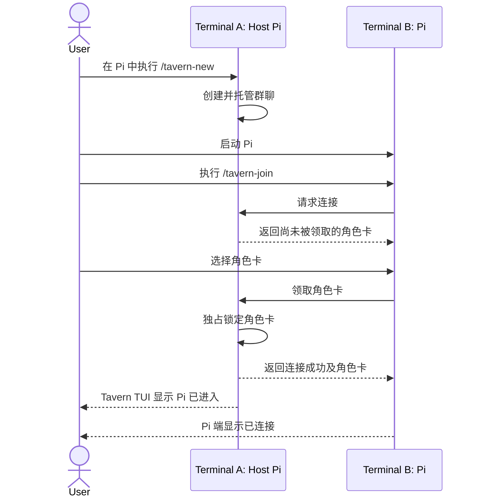

# PiTavern Interaction Model

本文记录当前已经确认的 PiTavern 交互逻辑。尚未确认的实现细节不在本文中预设。文中的名词遵循[术语规范](./terminology.md)。

## 产品形态

PiTavern 是一个 Pi 扩展，不提供独立的 Tavern 可执行程序。

所有进程运行在同一个本地代码仓库中：

```text
Repository
├── Terminal A: Pi → /tavern-new    → Host
├── Terminal B: Pi → /tavern-join   → Character
├── Terminal C: Pi → /tavern-join   → Character
└── ...
```

首版提供以下命令：

```text
/tavern-new
/tavern-resume
/tavern-join
/tavern-leave
/tavern-status
```

同一仓库同时只允许存在一个当前群聊。

## 群聊生命周期

### 新建群聊

用户在终端 A 启动普通 Pi，然后执行 `/tavern-new`：

- 当前 Pi 创建并托管群聊。
- `/tavern-new` 始终创建全新群聊，不恢复旧聊天。
- 已经存在当前群聊时命令失败。
- 当前 Pi 进入 Tavern Host 模式，但继续复用 Pi 原生界面，不实现独立全屏 TUI。
- Host 模式拦截普通文本输入，将其作为群聊中的用户消息，不触发 Host 自己的 Agent 回复。
- Host 不领取角色卡，也不进入角色发言队列。
- 如果用户还需要一个 AI 角色，应启动新的 Pi 进程加入群聊。

这与 SillyTavern 的模型一致：用户是独立参与者，创建者不是 Character Card。

### Host Pi

开启群聊的 Pi 进程负责通信、调度、持久化和用户界面，但不拥有群聊记录：

- 进入 Host 模式后，原 Pi session 暂停且保持不变。
- 群聊中的用户消息和角色回复不写入 Host 的原 Pi session。
- Host 执行 `/tavern-leave` 时关闭整个群聊，不转移 Host。
- 群聊关闭后，Host 返回原来的普通 Pi session。
- Host 进程意外退出时，当前群聊随之停止。

### 恢复群聊

任何位于同一项目中的 Pi 都可以执行 `/tavern-resume`：

- 命令列出当前项目的历史群聊，由用户选择一项。
- 恢复群聊记录和群聊设置，并由当前 Pi 成为新的 Host。
- 不恢复旧成员连接或角色卡领取状态。
- 各角色 Pi 必须重新执行 `/tavern-join` 并领取角色。
- 已经存在当前群聊时命令失败。

群聊不永久绑定最初创建它的 Pi 进程或 Pi session。

### Host 界面

首版复用 Pi 原生消息流和输入框：

- 群聊记录显示在 Host 的消息流中。
- 底部小组件只显示在线角色总数和当前发言角色。
- 在线人数只统计已领取角色卡的 Pi，不包含 Host。
- 空闲状态可显示为 `Tavern · 3 online · idle`。
- 发言状态可显示为 `Tavern · 3 online · Alice speaking`。
- `/tavern-status` 展开角色列表及其空闲、忙碌或生成中状态。
- 连接、离开和跳过忙碌角色等事件作为一次性系统通知显示。

## Pi 加入群聊



加入规则：

- `/tavern-join` 自动发现当前仓库内唯一的当前群聊，不要求输入群聊名称。
- 加入方主动选择一张尚未被领取的角色卡。
- 同一张角色卡同时只能由一个 Pi 领取。
- 已被领取的角色卡不会出现在其他 Pi 的可领取列表中。
- 连接成功只完成身份绑定，不发送欢迎消息，也不触发主动发言。
- Host 和加入方 Pi 都显示连接成功通知。
- 加入方保持普通 Pi 界面，显示群聊、角色、生成状态和连接通知。
- 加入方仍可在自己的 Pi 终端中正常交互。
- Pi 正在处理本地任务时，Tavern 本轮跳过该角色，不打断、不等待，也不追加延迟回复。
- Pi 执行 `/tavern-leave`、退出或连接断开后立即释放角色卡，其他 Pi 可以重新领取。
- 断线恢复后不自动重连，必须重新执行 `/tavern-join` 和领取角色。

## 群聊与角色私聊

群聊是所有角色沟通的公共区域，每个角色 Pi 的 session 是其私有空间：

- 角色加入群聊后，用户仍可在该 Pi 终端与它私聊或让它处理本地任务。
- 私聊内容只保存在该角色的私有 session，不写入群聊记录。
- 加入期间的公共消息作为公共事件写入角色的私有 session，使角色在后续私聊中记得群聊发生过什么。
- 公共事件在角色终端默认折叠，完整群聊由 Host 展示。
- 断线重进时按照群聊消息标识补齐缺失的公共事件，避免重复。
- 新 Pi 领取角色卡时可以获得当前群聊记录，但不能获得前一个 Pi 的私聊记忆。

私聊与公共生成使用严格的上下文边界：

- 私聊生成可以读取角色的私聊历史和它经历的公共事件。
- 公共生成只读取角色卡和群聊记录，不读取私聊内容。
- 角色的公共回复同时写入群聊记录，并作为公共事件写入该角色的私有 session。
- 私聊内容不会因摘要、上下文压缩或恢复群聊而混入公共上下文。

首版只有 Host 可以开启公共讨论：

- 普通私聊不会发送到群聊。
- 角色不能主动向群聊发言，也不能自行开启公共回合。
- 首版不提供从角色终端公开发言的命令。
- 未来可以兼容由用户显式触发的公开发言，但不支持角色自主公开发言。

## Character Markdown

角色卡是一个子 Agent 的角色提示词，以带 YAML frontmatter 的 Markdown 文件表示：

```markdown
---
name: Architect
talkativeness: 0.5
---

你是一名软件架构师……
```

规则：

- 一个 Markdown 文件表示一张角色卡。
- `name` 是唯一必填的 frontmatter 字段，用于界面展示和 `@提及`。
- `talkativeness` 可选，缺省值为 `0.5`，语义对齐 SillyTavern。
- Markdown 正文是完整角色提示词。
- 第一版只支持 PiTavern Character Markdown，不导入 SillyTavern 的 JSON、PNG 或 CHARX Character Card。
- 内部 `characterId` 使用角色卡相对于其来源配置文件的规范化路径。
- 角色领取、释放和消息归属使用 `characterId`，不使用显示名称。
- 导入池中出现重复 `name` 时配置无效，以避免领取和 `@提及` 产生歧义。
- 移动或重命名角色卡文件会产生新的角色身份。

## 配置

PiTavern 使用独立配置，不向 Pi 的 `.pi/settings.json` 添加自定义字段。

支持两层配置：

```text
Global:  ~/.pi/agent/tavern.json
Project: <repo>/.pi/tavern.json
```

两层配置都可以通过 `characters` 导入单个角色卡或角色卡目录：

```json
{
  "characters": [
    "../characters",
    "../characters/architect.md"
  ]
}
```

导入规则：

- 路径相对于声明它的 `tavern.json` 解析。
- 文件路径加载一张 Character Markdown。
- 目录路径递归发现其中的 Character Markdown。
- 全局与项目配置合并加载，不由项目配置整体覆盖全局配置。
- `/tavern-join` 同时展示全局与项目角色卡。
- 任意来源的角色卡出现重复 `name` 时配置无效。
- 首版不提供从项目配置中排除某个全局角色的机制。

## Tavern 对话

首版只采用 Natural Order，不提供 SillyTavern 的 List、Manual 或 Pooled 策略。

已经确认的对话边界：

- 只有 Host 用户消息可以开启公共讨论。
- 消息中被提到的角色具有更高的参与优先级。
- 其他角色根据各自的 `talkativeness` 参与。
- 同一时刻，每个角色 Pi 的私聊和本地任务仍可独立运行。
- 忙碌角色不被公共调度打断或等待。
- 如果没有角色被选中，至少选择一位可用角色。
- 角色不能自行增加公共发言次数，也不能在没有 Host 发起讨论时发言。

公共调度不再预设为严格串行队列。目标是使用受限的反馈过程，让同一角色可以在一次讨论中发言多次，同时通过 PiTavern 维护的额度防止无限对话。以下机制仍待参考 OpenClaw 等多 Agent 项目后确定：

- 总发言次数、本轮或本批次次数，以及从私聊终端显式增加的角色次数如何共同生效。
- 同一批角色是否基于相同群聊快照并行生成。
- 并行结果的写入顺序及下一批的反馈屏障。
- `@角色` 对参与名单和额度的影响。
- 忙碌、失败或取消是否消耗次数。
- 新 Host 消息如何中止或排队当前讨论。

无论最终采用哪种调度方式，都必须满足：

- 只有用户可以通过明确命令增加发言额度。
- 普通私聊和 Agent 输出不能增加额度。
- 所有额度耗尽后讨论立即停止。
- 不允许角色形成无上限的自主对话循环。

## 代码协作与同步

所有 Pi 使用同一个工作区。PiTavern 负责沟通，不仲裁代码写入：

- 不设置仓库写锁，也不限制同时写入的角色数量。
- 每个 Pi 保留自身的工具权限和审批规则，PiTavern 不扩大权限或自动批准操作。
- 所有角色直接读取共享工作区中的最新文件状态。
- 共享文件系统是代码状态的事实来源，群聊用于同步意图、进度、发现和结论。
- 群聊只同步角色的公开发言，不同步文件读取、命令输出或逐次工具调用。
- Host 底栏只显示当前工作角色，不展开其工具执行过程。
- 角色通过后续公开发言说明修改结果；用户可以增加公共发言次数以支持反馈和修正。
- PiTavern 不自动合并、回滚或解决代码冲突；角色通过群聊和实际工作区状态继续协调。

## 持久化

群聊记录与各个 Pi session 分开保存：

- `/tavern-new` 创建群聊时立即建立独立的群聊记录。
- 用户消息写入群聊记录后立即保存。
- 每条完整的角色回复写入后立即保存。
- 群聊设置变化后立即保存。
- 正在生成但尚未完成的回复不作为完整消息保存。
- Host 正常离开或意外退出后，均可恢复到最后一条完整消息。
- 群聊记录和群聊设置可恢复。
- 成员连接、角色领取状态和各角色的私聊 session 不属于群聊持久化内容。

## 参考实现

### SillyTavern

- `references/SillyTavern/public/scripts/group-chats.js`
  中的 `generateGroupWrapper` 实现群聊入口和串行生成队列。
- 同一文件中的 `activateNaturalOrder` 实现 Natural Order。
- 群成员使用角色文件标识而不是显示名称作为内部身份。
- Reply Strategy 包括 Natural、List、Manual 和 Pooled。

SillyTavern 使用 AGPL-3.0。PiTavern 只借鉴其交互机制和行为，不复制实现代码。

### Pi Coding Agent

`references/pi-mono/packages/coding-agent/docs/extensions.md` 说明了 Pi 扩展可用于：

- 注册 `/` 命令；
- 拦截 Host 模式中的普通输入；
- 在原生界面中渲染群聊消息、状态和通知；
- 使用选择界面领取角色卡；
- 在 Pi 终端显示连接通知；
- 将 Tavern 消息送入 Pi 会话。

`references/pi-mono/packages/coding-agent/docs/skills.md` 提供了文件和目录资源导入、Markdown frontmatter 解析及全局/项目配置分层的设计参考。

## 尚未确认

- Tavern 与 Pi 扩展之间的通信协议。
- 公共讨论的并行、反馈和发言额度模型。
- 发言额度相关命令的名称、参数和默认值。
- 群聊记录与角色公共事件的持久化格式及存储路径。
- 历史聊天在 `/tavern-resume` 列表中的命名方式。
