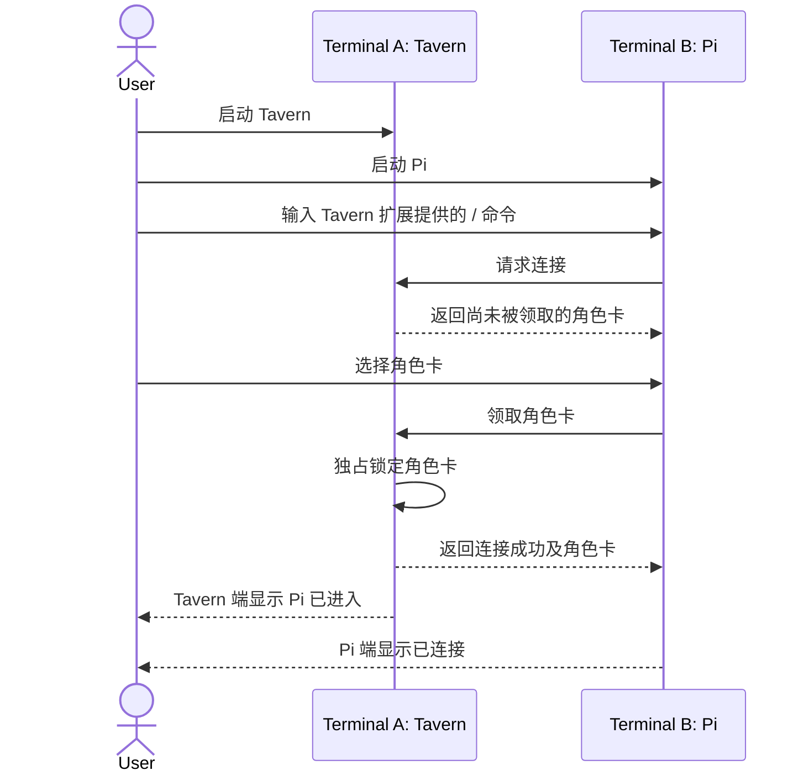

# PiTavern Interaction Model

本文记录当前已经确认的 PiTavern 交互逻辑。尚未确认的实现细节不在本文中预设。

## 运行模型

Tavern 和所有 Pi 进程运行在同一个本地代码仓库中：

```text
Repository
├── Terminal A: Tavern
├── Terminal B: Pi
├── Terminal C: Pi
└── ...
```

- Tavern 是聊天室进程，维护房间、角色卡、共享聊天记录和发言队列。
- Pi 是独立启动的正常交互进程，通过扩展连接 Tavern。
- Tavern 不负责启动或销毁 Pi 进程。
- Pi 加入 Tavern 后仍可在自己的终端中使用。

## Pi 进入 Tavern



连接成功仅表示 Pi 已进入 Tavern：

- 不发送欢迎消息。
- 不触发 Pi 主动发言。
- 同一张角色卡同时只能由一个 Pi 领取。
- 已被领取的角色卡不会出现在其他 Pi 的可领取列表中。
- Pi 离开或断开后，角色卡被释放，可由其他 Pi 重新领取。

## Tavern 对话

PiTavern 参考 SillyTavern 的中心化群聊调度：

1. 用户在 Tavern 中发送消息。
2. Tavern 将消息写入共享聊天记录。
3. Tavern 根据房间的 Reply Strategy 生成本轮发言队列。
4. Tavern 按队列顺序逐个请求对应 Pi 回复。
5. Pi 使用最新共享聊天记录和自己领取的角色卡生成回复。
6. 每条 Pi 回复写回共享聊天记录，后续 Pi 因而能看到本轮前面的回复。
7. 未进入队列的 Pi 本轮保持沉默。

### Natural Order

参考 SillyTavern 的 Natural Order：

- 消息中被提到的角色优先进入队列。
- 其他角色按照各自的 `talkativeness` 参与本轮。
- 默认避免上一位角色连续发言。
- 如果没有角色被选中，至少选择一位可用角色。
- 生成过程是串行队列，不是所有 Pi 同时抢答。

## 参考实现

### SillyTavern

- 群聊入口和串行生成队列：
  `references/SillyTavern/public/scripts/group-chats.js`
  中的 `generateGroupWrapper`。
- Natural Order：
  同一文件中的 `activateNaturalOrder`。
- Reply Strategy 包括 Natural、List、Manual 和 Pooled。

SillyTavern 使用 AGPL-3.0。PiTavern 只借鉴其交互机制和行为，不复制实现代码。

### Pi Coding Agent

`references/pi-mono/packages/coding-agent/docs/extensions.md` 说明了 Pi 扩展可用于：

- 注册 `/` 命令；
- 使用选择界面领取角色卡；
- 在 Pi 终端显示连接通知；
- 将 Tavern 消息送入 Pi 会话。

## 尚未确认

- `/` 命令的具体名称和参数。
- Tavern 与 Pi 扩展之间的通信协议。
- Reply Strategy 的首版支持范围。
- 异常断线、重连和角色卡释放的超时策略。
- 聊天记录与角色卡的持久化格式。
