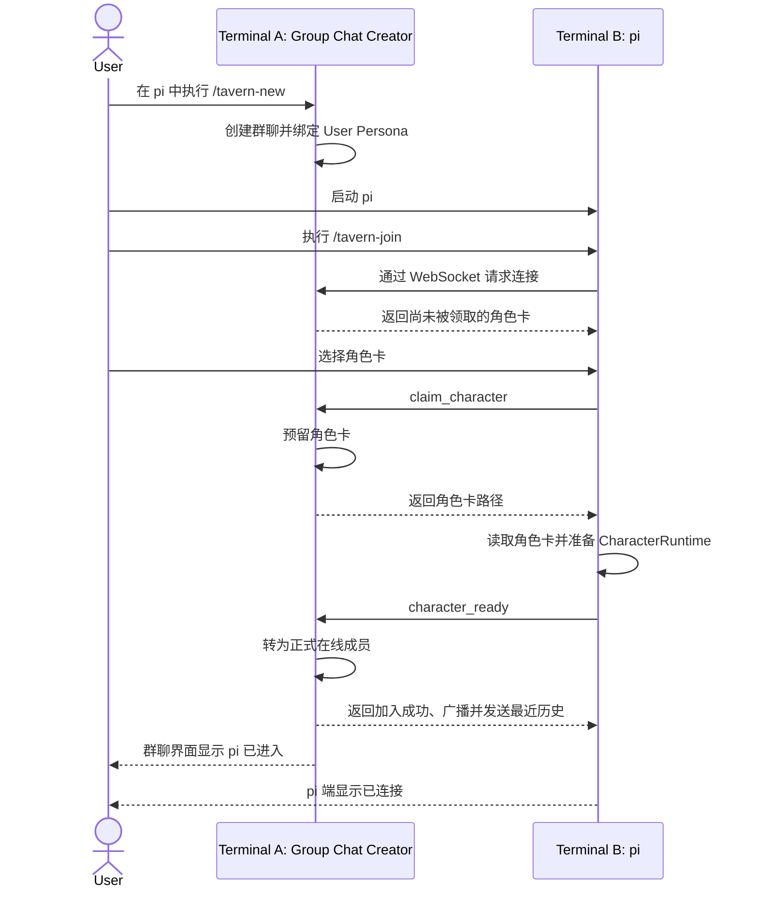

# PiTavern Interaction Model

本文记录当前已经确认的 PiTavern 交互逻辑。尚未确认的实现细节不在本文中预设。文中的名词遵循[术语规范](./terminology.md)。

## 产品形态

PiTavern 是一个 pi-coding-agent 扩展，不提供独立的 Tavern 可执行程序。

所有进程运行在同一个本地代码仓库中：

```text
Repository
├── Terminal A: pi → /tavern-new    → Group Chat Creator / User Persona
├── Terminal B: pi → /tavern-join   → Character
├── Terminal C: pi → /tavern-join   → Character
└── ...
```

首版提供以下命令：

```text
/tavern-new
/tavern-resume
/tavern-join
/tavern-leave
/tavern-status
/tavern-set-max
/tavern-name
```

同一项目可以同时存在多个活动群聊，每个活动群聊由独立的群聊创建者 pi 承载。

一个 pi 同时只能绑定一个群聊：

- 成为群聊创建者和作为 Character 加入群聊互斥。
- 已绑定群聊时执行 `/tavern-new`、`/tavern-resume` 或 `/tavern-join` 均失败，并提示先执行 `/tavern-leave`。
- 角色 pi 离开后移除群聊输入模块和 Character 提示词，保留并继续使用原 pi Agent 和 pi session。
- 群聊创建者关闭群聊后恢复原私有 pi session；之后可以创建、恢复或加入其他群聊。

扩展运行期使用 `idle`、`creator`、`joining` 和 `character` 四个状态。首版不定义 `disconnected` 或 `reconnecting`；连接断开直接清理并回到 `idle`。创建、恢复、加入和离开过程使用内部 transition lock 串行保护，但不增加长期业务状态。

## 群聊生命周期

### 新建群聊

用户在终端 A 启动普通 pi，然后执行 `/tavern-new`：

- 当前 pi 创建并托管群聊。
- 新群聊从当前已解析配置的 `configMaxMessages` 继承一次，生成并保存自己的 `groupMaxMessages`。
- `/tavern-new` 始终创建全新群聊，不恢复旧聊天。
- 项目中已经存在其他活动群聊时，仍可由新的 pi 创建群聊。
- 当前 pi 成为群聊创建者，并默认绑定代表用户的 User Persona。
- User Persona 是群聊内置的 `user` role，不使用 Markdown、配置文件或选择界面。
- 群聊创建者继续复用 pi-coding-agent 原生界面，不实现独立全屏 TUI。
- 群聊创建者模式拦截普通文本输入，以 User Persona 身份发送群聊消息，不触发当前 pi 自己的 Agent 回复。
- User Persona 不领取角色卡，也不进入 Character 发言队列。
- 如果用户还需要一个 AI 角色，应启动新的 pi-coding-agent 进程加入群聊。
- 当前处于 `joining`、`creator` 或 `character` 时，执行 `/new`、`/resume`、`/fork`、`/clone` 等会创建或切换 pi session 的原生命令，PiTavern 先询问是否退出当前群聊并继续。
- 用户取消确认时阻止原生 session 操作并保持当前状态；用户确认时先完成退出，再允许 pi 执行原生操作。
- Creator 的退出会关闭整个群聊；Character 的退出执行正常离开；`joining` 的退出关闭连接并释放可能存在的 Character 预留。
- 退出一旦完成便不撤销。后续 `/new`、`/resume`、`/fork` 或 `/clone` 即使失败、取消或没有实际完成，PiTavern 也保持 `idle`，不自动恢复或重新加入群聊。
- `/reload` 不属于上述退出流程。当前 pi session 不变时，Creator 或 Character 通过 reload 专用的一次性运行资源交接保持原群聊身份和 WebSocket，不关闭群聊、不离开、不重新连接。
- `joining` 不参与 reload 资源交接；reload 时关闭加入连接、释放 Character 预留，新 Extension Runtime 从 `idle` 开始。
- Creator reload 只交接已经正式在线的 Character；创建者侧尚未完成 `character_ready` 的连接释放预留并关闭，reload 窗口内的新连接也直接关闭。
- reload handoff 必须在 5 秒内由新 Extension Runtime 接管；超时后释放全部 handoff 资源，随后加载的 Runtime 从 `idle` 开始，不自动恢复。
- pi 正常退出并触发 `session_shutdown(reason: "quit")` 时，PiTavern 先退出或关闭群聊，再允许 pi 继续退出。清理最多等待 5 秒；超时后停止等待远端确认并强制完成本地 WebSocket 清理。
- 强杀、崩溃和断电无法保证执行正常退出流程，依靠 WebSocket close、心跳超时和活动描述发现机制收敛。

这与 SillyTavern 的模型一致：用户是独立参与者，创建者不是 Character Card。

User Persona 只是一种消息身份：

- 群聊 JSONL 中以 `pi-tavern.public-message` 保存，并在 sender 中标识为 `user_persona`。
- UI 复用 pi-coding-agent 的用户消息样式，不额外显示角色名。
- 角色 pi 的群聊输入模块通过 sender 类型识别用户发言。
- User Persona 不占用 Character，也不进入 Character 导入或领取池。

### 群聊创建者

开启群聊的 pi-coding-agent 进程负责通信、调度、持久化和用户界面，但不拥有群聊记录：

- 成为群聊创建者后，原 pi session 暂停且保持不变。
- 群聊中的 User Persona 消息和 Character 回复不写入创建者的原 pi session。
- 群聊创建者执行 `/tavern-leave` 时直接关闭整个群聊，不要求二次确认，也不转移创建者身份。
- 关闭时先停止接受新请求，再向全部在线 Character 广播 `group_chat_closed`；广播写入连接后断开所有 Character WebSocket。
- `group_chat_closed` 是终止信号，不触发新的 pi Agent run；当前 pi Agent 已经在处理的对话不强制中断，但不能再向已关闭群聊公开发言。
- 关闭后删除活动描述文件，但不向群聊记录追加关闭或结束状态；记录停留在最后一条完整内容，之后仍可 `/tavern-resume`。
- 群聊关闭后，创建者返回原来的普通 pi session。
- 创建者进程意外退出时，当前群聊随之停止。

### 恢复群聊

任何位于同一项目中的 pi 都可以执行 `/tavern-resume`：

- 命令列出当前项目的历史群聊，由用户选择一项。
- 恢复群聊记录和群聊设置，并由当前 pi 成为新的群聊创建者、绑定 User Persona。
- 不恢复旧成员连接或角色卡领取状态。
- 各角色 pi 必须重新执行 `/tavern-join` 并领取角色。
- 恢复后不自动重新加入旧 Character；所有角色均由用户手动加入。
- 项目中存在其他活动群聊不影响恢复。
- 被选择的历史群聊已经处于活动状态时不能重复恢复。

群聊不永久绑定最初创建它的 pi-coding-agent 进程或 pi session。

### 群聊命名

群聊名称复用 pi-coding-agent 的 session name 语义：

- `/tavern-name <name>` 设置当前群聊的可选显示名。
- `/tavern-name` 只允许当前群聊创建者执行；Character 通过 `/tavern-status` 查看群聊名称。
- 名称只用于展示，不作为群聊身份；内部始终使用 `groupChatId`。
- 名称允许重复，不做唯一性校验。
- 设置时将换行替换为空格并去除首尾空白，与 pi-coding-agent 的 session name 规范化一致。
- `/tavern-name` 不带参数时，已有名称则显示当前名称；没有名称则显示用法提示。
- `/tavern-resume` 中已命名群聊显示名称，未命名群聊使用第一条 User Persona 消息展示。
- 重命名作为群聊元数据持久化，不修改聊天消息。
- `/tavern-resume` 的历史删除交互复用 pi-coding-agent `/resume`：使用相同的删除快捷键和确认流程，并在可用时优先通过系统废纸篓删除。

### 群聊创建者界面

首版复用 pi-coding-agent 原生消息流和输入框：

- 群聊记录显示在群聊创建者的消息流中。
- 底部小组件只显示在线角色总数和当前发言角色。
- 在线人数只统计已领取角色卡的 pi，不包含 User Persona。
- 空闲状态可显示为 `Tavern · 3 online · idle`。
- 发言状态可显示为 `Tavern · 3 online · Alice speaking`。
- `/tavern-status` 展开角色列表及其当前 pi Agent 的 `isStreaming` 状态和举手状态。
- `/tavern-status` 同时显示 `configMaxMessages`、`groupMaxMessages`、`roundMaxMessages`、`usedMessages` 和 `remainingMessages`。
- 连接、离开和举手等事件作为一次性系统通知显示。
- Character 举手时显示一次通知，但不改变底部小组件的信息范围。

## pi 加入群聊



加入规则：

- `/tavern-join` 自动发现当前项目的活动群聊。
- 没有活动群聊时提示当前无可加入群聊。
- 只有一个活动群聊时直接选择；存在多个时显示群聊选择界面。
- 发现无法连接或 PID 已不存在的活动描述文件时将其清理，不影响其他群聊。
- 加入方主动选择一张尚未被预留或正式加入的角色卡。
- 同一张角色卡在同一个群聊中同时只能由一个 pi 预留或使用；不同群聊的状态相互独立。
- 已被预留或已经在线的角色卡不会出现在其他 pi 的可领取列表中。
- `claim_character` 成功后预留 Character 并返回 Character Markdown 的本机绝对路径；加入方直接读取角色卡并准备本地运行组件，再通过 `character_ready` 正式加入群聊。正式加入后自动收到最近 10 条公开消息，完整群聊记录按需通过群聊记录文件读取。
- Character 预留只等待 5 秒；超时后创建者释放预留并关闭 WebSocket，加入方直接回到 `idle`，不增加中间状态。
- 群聊输入模块将最近消息合并为环境批次；固定 1 秒防抖结束后主动获取最新群聊状态，再把环境批次和状态快照作为一次输入提交给当前 pi Agent。
- 首次环境处理没有特殊的禁言规则；`tavern_speak` 是否被接受只由当前 Round 的剩余发言次数判断。
- `character_ready` 成功后没有额外的等待或激活状态；公开发送是否被接受只由当前 `roundMaxMessages` 判断。
- 群聊创建者和加入方 pi 都显示连接成功通知。
- Character 完成 `character_ready` 后，加入事件向包括新成员在内的全部在线 Character 广播。群聊已有公开消息时该事件作为公共环境事件参与 1 秒防抖。
- 群聊尚无公开消息时，加入和离开广播只用于界面通知，不进入环境批次，也不触发 pi Agent；第一条 User Persona 消息落盘后，后续成员事件才参与防抖。
- 加入方保持普通 pi-coding-agent 界面，显示群聊、角色、生成状态和连接通知。
- 群聊创建者只接收角色 pi 当前 Agent 的原生 `isStreaming` 布尔状态，不接收触发来源、用户终端输入内容或其他 session 细节。
- 加入方仍可在自己的 pi 终端中正常交互。
- 当前 pi Agent 正在生成回复时，PiTavern 使用该 pi-coding-agent session 的原生 follow-up queue 接收新的合并群聊输入，不打断正在进行的生成。
- Character pi 执行 `/tavern-leave` 时，群聊创建者先移除成员并立即释放角色卡，再向剩余在线 Character 广播 `character_left`；其他 pi 随后可以重新领取。
- WebSocket 意外断开后，角色 pi 立即退出当前群聊，停用 `tavern_speak` 和群聊输入模块，并移除 Character system prompt。
- 尚未提交的防抖批次立即丢弃；已经写入当前 pi session 或进入原生 follow-up queue 的群聊输入不撤销、不移除。
- 当前正在进行的 Agent run 不打断；断线后 `tavern_speak` 已停用，后续普通输出只能保留在当前 pi session。
- 角色 pi 使用当前 pi session 的 `sessionId` 作为群成员连接身份；PiTavern 不创建另一个 Agent session ID。
- 群聊创建者在连接断开时立即移除成员并释放角色卡，再以 `disconnected` 原因向剩余在线 Character 广播 `character_left`。
- 首版没有自动重连、重连窗口或成员恢复逻辑。
- 用户需要手动重新执行 `/tavern-join`、预留 Character 并完成 `character_ready`；成功后启用提示词和工具，并收到最近 10 条公开消息。
- 群成员关系绑定角色 pi 加入时的当前 `sessionId`。
- `/new`、`/resume`、`/fork`、`/clone` 等操作产生或切换到不同 `sessionId` 前，PiTavern 先取得用户确认，再执行正常离开流程并允许 pi 完成原生 session 切换。
- session 切换不继承群成员关系、Character system prompt、群聊输入模块或 `tavern_speak`；切换完成后由用户手动重新加入。
- 退出完成后，后续 session 操作失败或取消也不撤销群聊退出，不自动重连。
- 不改变 `sessionId` 的同 session 操作不退出群聊。

## WebSocket 连接

PiTavern 扩展之间使用 WebSocket 传递实时消息和成员状态：

- 群聊创建者监听 `127.0.0.1:0`，由操作系统分配空闲端口，不暴露到局域网。
- 每个活动群聊拥有独立的 WebSocket 端口。
- 监听成功后，创建者在项目对应的 `active/` 目录写入以 `groupChatId` 命名的活动描述文件。
- 活动描述包含 `instanceId`、`groupChatId`、创建者 PID、监听地址、实际端口和启动时间，供 `/tavern-join` 自动发现。
- 活动描述只提供候选地址；PID 检查用于排除退出进程，实际 WebSocket 连接才是有效性的最终判断。
- `groupChatId` 是持久群聊身份；`instanceId` 是每次新建或恢复时重新生成的运行实例身份，不写入群聊 session。
- WebSocket URL 路径同时携带 `groupChatId` 和 `instanceId`，创建者在 upgrade 阶段校验后才接受连接。
- 同一个历史群聊同时只能有一个活动创建者；`/tavern-resume` 标记并禁止选择已经活动的群聊。
- 恢复时通过排他创建活动描述完成最终一次性占用；并发恢复只有一个 pi 可以成功。
- 一个加入方 WebSocket 连接对应一个群成员。
- 首版运行在同一台机器和代码仓库中，不使用证书或 token。
- 群聊创建者每 30 秒发送标准 WebSocket `ping`；任一方连续 120 秒没有收到对应心跳时终止连接。
- 普通 WebSocket `close/error` 立即处理；心跳超时只兜底检测半开连接，不产生 JSON 消息或自动重连。
- 公开消息带有群聊内递增的消息序号；每次 `character_ready` 成功后统一发送最近 10 条公开消息，不实现自动重连或基于最后应用序号的补发。
- 以后支持远程连接时再增加鉴权，首版不预设远程安全模型。

## 群聊与角色私聊

群聊是所有角色沟通的公共区域，但角色 pi 不为群聊创建第二个 Agent 或第二个 session。用户终端输入和 PiTavern 群聊输入模块都是当前 pi Agent 的输入来源：

- 角色加入群聊后，用户仍可在同一个 pi 终端正常对话并安排本地任务。
- 用户终端输入按照 pi 原生逻辑进入当前 pi session，不自动发送到群聊。
- WebSocket 环境消息先经过固定 1 秒防抖，不逐条直接写入 pi session。
- 防抖结束后，PiTavern 将环境批次和最新群聊状态合成为一次群聊输入，提交给当前 pi Agent。
- 群聊输入使用 `customType: "pi-tavern.group-chat-input"` 的 pi 原生 `custom_message`；结构化批次和状态保存在 `details`，Agent 可读投影保存在 `content`。
- 该输入及随后产生的 assistant 回复、工具调用和工具结果都按照 pi 原生逻辑记录在当前 pi session 中。
- 群聊输入固定使用 `deliverAs: "followUp"` 和 `triggerTurn: true`；当前 pi Agent 空闲时立即触发，忙碌时进入同一个 pi session 的原生 follow-up queue。
- 只有 `tavern_speak` 的成功内容进入群聊记录；普通 assistant 文本、用户终端输入和其他本地过程不会自动公开。

Character Markdown 是当前 pi Agent 在加入期间使用的稳定 system prompt 扩展：

- `claim_character` 预留成功后读取并解析一次，随后缓存在角色 pi 内存中。
- 加入期间对用户终端输入和群聊输入触发的 Agent run 都生效。
- pi 的 `before_agent_start` 在每次 Agent run 中应用同一份缓存提示词，但不重新读取角色文件。
- Character Markdown 不拼接到防抖后的群聊输入，也不作为消息写入 pi session。
- 离开群聊时移除该 system prompt 扩展。
- 已加载的提示词不因角色卡文件变化自动替换。
- 它不代表另一个 Agent、session、群成员或持久身份。

手动重新加入时不执行消息去重；最近 10 条公开消息重新进入环境防抖。新 pi 领取同一 Character 时只能获得自己的 pi session、Character Markdown、最近公开消息和按需读取的群聊记录，不能获得前一个 pi 的 session、隐藏状态、临时草稿、未公开回复或 follow-up queue。

```text
角色 pi
└── 当前 pi Agent / pi session
    ├── 加入期间稳定生效的 Character system prompt
    ├── 用户终端输入
    ├── PiTavern 群聊输入
    │   ├── 防抖后的环境批次
    │   └── 最新群聊状态
    ├── pi-coding-agent follow-up queue
    └── tavern_speak
```

首版只有 User Persona 消息可以开启公共讨论：

- 普通私聊不会发送到群聊。
- 角色不能自行开启公共回合。
- Character 只通过 PiTavern 提供的 `tavern_speak` Agent tool 尝试公开发言。
- 首版不提供从角色终端公开发言的 `/` 命令。
- 全局发言次数耗尽后，角色可以举手表达继续发言的意图；举手不是公开发言。
- 未来可以兼容由用户显式触发的公开发言，但不支持角色绕过额度自主公开发言。

## Character Markdown

角色卡是当前 pi Agent 加入群聊期间使用的角色提示词，以带 YAML frontmatter 的 Markdown 文件表示：

```markdown
---
name: Arch
description: 负责系统设计、技术决策和架构风险分析
---

你是一名软件架构师……
```

规则：

- 一个 Markdown 文件表示一张角色卡。
- `name` 和 `description` 是必填的 frontmatter 字段。
- `name` 用于界面展示和 `@提及`。
- `description` 是公开的角色简介，用于角色选择器、在线角色列表和状态界面。
- Markdown 正文是完整角色提示词。
- `claim_character` 预留成功时加载一次正文，`character_ready` 成功后在加入期间作为稳定的 system prompt 扩展应用于当前 pi Agent。
- 角色提示词不重复拼接到每条群聊输入，也不作为聊天消息写入 pi session。
- Character 列表只发送 `name` 和 `description` 等公开摘要，不发送 Markdown 正文。
- 第一版只支持 PiTavern Character Markdown，不导入 SillyTavern 的 JSON、PNG 或 CHARX Character Card。
- 内部 `characterId` 使用角色卡相对于其来源配置文件的规范化路径。
- 角色领取、释放和消息归属使用 `characterId`，不使用显示名称。
- 导入池中出现重复 `name` 时配置无效，以避免领取和 `@提及` 产生歧义。
- 移动或重命名角色卡文件会产生新的角色身份。

## 配置

PiTavern 使用独立配置，不向 pi-coding-agent 的 `.pi/settings.json` 添加自定义字段。

`configMaxMessages` 的首版默认值为 `10`。新建群聊时将当前解析出的值继承为该群聊的 `groupMaxMessages`。

标量配置按照项目优先解析：

```text
project.configMaxMessages
  ?? global.configMaxMessages
  ?? 10
```

支持两层配置：

```text
Global:  ~/.pi/agent/tavern.json
Project: <repo>/.pi/tavern.json
```

两层配置都可以通过 `characters` 导入单个角色卡或角色卡目录：

```json
{
  "characters": [
    "../characters",
    "../characters/architect.md"
  ]
}
```

导入规则：

- 路径相对于声明它的 `tavern.json` 解析。
- 文件路径加载一张 Character Markdown。
- 目录路径递归发现其中的 Character Markdown。
- 全局与项目配置合并加载，不由项目配置整体覆盖全局配置。
- `characters` 等列表配置合并加载；`configMaxMessages` 等标量配置由项目值覆盖全局值。
- `/tavern-join` 同时展示全局与项目角色卡。
- 任意来源的角色卡出现重复 `name` 时配置无效。
- 首版不提供从项目配置中排除某个全局角色的机制。

### 配置错误

- 全局或项目 `tavern.json` 无法解析时，依赖该配置的新建或加入命令失败，并显示具体文件；
- 配置合并后的字段不符合 schema 时命令失败，不使用猜测值或部分默认值继续运行；
- 配置导入的任一 Character Markdown 无法读取、frontmatter 非法或缺少必需字段时，创建或加入流程失败并列出对应文件；
- 不静默跳过无效 Character，避免不同 pi 根据读取时机得到不同的可领取列表；
- 已经启动的 CreatorRuntime 或 CharacterRuntime 继续使用启动时加载的配置和 Character prompt，不监听文件变化。

## Tavern 对话

首版不采用 SillyTavern 的 Natural、List、Manual 或 Pooled 候选选择策略。PiTavern 将每条公共消息和最新发言次数广播给所有已连接的角色 pi，由各个 pi 独立决定是否发言。

- 最近历史消息和新的公开消息是群聊输入模块的环境事件；成员加入和离开只在群聊已经产生公开消息后成为环境事件。
- 群聊状态由 Character 在提交环境批次前主动获取，作为当前 pi Agent 使用的最新环境快照；群聊状态响应本身不触发 Agent。
- Character 使用固定 1 秒的 trailing-edge debounce 合并连续到达的环境消息；每次收到新环境消息都重新计时。
- 防抖结束时，Character 先请求最新群聊状态，再把环境批次和状态快照合并为一次群聊输入；当前 pi Agent 空闲时立即提交，正在运行时作为一条 follow-up 交给 pi-coding-agent 原生队列。
- 防抖只形成短暂的环境批次，不替代 pi-coding-agent 的消息队列，也不增加用户配置。
- 当前 pi Agent 根据合并后的环境变化自行决定执行本地动作、尝试公开发言或保持沉默。
- Character 只向群聊创建者上报当前 pi Agent 的原生 `isStreaming` 状态；状态不向其他 Character 广播。
- Character 自己公开消息的回传确认和普通请求响应不作为新的 Agent 环境输入。

每条 User Persona 消息都会刷新并开启一个新的讨论轮次（Round）。Round 维护自己的发言上限：

```text
roundMaxMessages
```

- `roundMaxMessages` 是本轮 Character 公共消息总数的硬上限。
- 只有真实的 Character 公共回复消耗 `roundMaxMessages`。
- User Persona 消息以及加入、离开、断线等系统事件均不消耗 `roundMaxMessages`。
- PiTavern 不保证每个 Character 获得固定次数的发言机会；Character 不想发言时保持沉默。

新的 User Persona 消息刷新 Round 时：

- 新 Round 从当前群聊的 `groupMaxMessages` 继承一次，生成不可变的 `roundMaxMessages`，并将 `usedMessages` 重置为 `0`。
- 已经开始的 Character 生成不取消。
- 新公共消息经过各个角色 pi 的防抖后，通过当前 pi session 的 follow-up queue 投递；具体排队和投递顺序沿用 pi-coding-agent 自身设置。
- 角色 pi 的群聊输入模块不维护 Round，也不接收或判断 `roundId`。
- Character 完成生成后直接尝试向 Tavern 发送；Tavern 按消息到达时当前 Round 的额度处理。
- 群聊输入只需要携带广播中的 `roundMaxMessages`、`usedMessages` 和 `remainingMessages`。

### 调度与反馈

- User Persona 消息和成功进入群聊的 Character 消息始终广播给所有已连接的角色 pi。
- Character 消息的发送方也接收自己的广播，用于确认正式消息序号并同步最新次数；自己的消息不再次触发该 pi 生成回复。
- 广播同时携带最新的 `usedMessages`、`roundMaxMessages` 和 `remainingMessages`。
- Tavern 不预选候选 Character，也不预留发言额度。
- 各个角色 pi 收到广播后独立决定回复或保持沉默。
- Character 只有调用 `tavern_speak` Agent tool 才会尝试发送公共回复；不调用工具即保持沉默。
- 普通 assistant 文本、工具调用和命令输出始终留在私有 pi session，不自动进入群聊。
- Tavern 按收到 WebSocket 消息的先后顺序原子处理并分配群聊消息序号（原子：处理与分配作为一个整体一次完成，不出现中间可见态）。
- `usedMessages < roundMaxMessages` 时接受回复、增加次数，并向所有角色 pi 广播消息和最新次数。
- 达到上限后收到的回复不进入群聊，完整内容保留在发送方私有 pi 中，并将该成员标记为举手。
- 同一 Character 可以在一个 Round 中发言多次，不要求角色之间平均分配消息。
- 正在生成的当前 pi Agent 不被打断；新的群聊输入使用 pi-coding-agent 的 `followUp` 投递模式。
- 达到 `roundMaxMessages` 时本轮公开发言立即停止。

发言上限使用三级单向继承：

```text
configMaxMessages
        ↓ 新建群聊时继承一次
groupMaxMessages
        ↓ 新建 Round 时继承一次
roundMaxMessages
```

- `configMaxMessages` 是全局或项目配置解析出的新群聊默认值。
- `groupMaxMessages` 是当前群聊持久化的默认值；新建群聊时从 `configMaxMessages` 继承。
- `/tavern-set-max <count>` 使用绝对值设置当前群聊的 `groupMaxMessages`，不修改配置文件。
- `/tavern-set-max` 不支持 `+N`、`-N` 等增减语法。
- `/tavern-set-max` 只允许当前群聊创建者执行。
- `roundMaxMessages` 是当前 Round 的不可变快照；新 Round 创建时从 `groupMaxMessages` 继承。
- 修改 `configMaxMessages` 不影响已经存在的群聊。
- 修改 `groupMaxMessages` 不影响已经开始的 Round，只影响之后创建的新 Round。
- `remainingMessages` 始终由 `max(0, roundMaxMessages - usedMessages)` 得出。
- 三级变量的修改和继承都不回溯：不删除已接受消息，也不重新公开已经转为举手的回复。

### 举手

`roundMaxMessages` 耗尽后，Character 如果仍有必要发言，可以向 PiTavern 发送举手（Hand Raise）状态：

- 举手不是公共发言，不消耗 `roundMaxMessages`。
- 举手只是临时 UI 提醒，用于引导用户前往对应角色的私有 pi session 查看具体回复。
- 群聊创建者只看到举手的 Character 和对应 pi session，不在群聊中展示具体内容。
- 超额生成的完整回复只保留在该 Character 的私有 pi session 中。
- 同一群成员只保留一个未处理的举手状态；重复举手更新私有意图，不重复产生通知。
- 修改 `groupMaxMessages` 不会改变当前 Round，也不会自动公开已有举手内容；Character 必须在后续 Round 重新发起发送，并继续遵循先到先得。
- 举手不进入待发送队列，也不赋予 Character 后续发言优先级。
- 新 User Persona 消息刷新 Round 时清除上一 Round 的全部举手状态。
- Character 后续成功发言、主动撤回举手、离开群聊后，同样清除其举手状态。

Hand Raise Intent、Hand Raise Status 和 Character Message 必须分开：

```text
Hand Raise Intent   私有，仅对应的角色 pi 可见
Hand Raise Status   公共状态，只表示谁想发言
Character Message   公共消息，消耗 roundMaxMessages
```

只有用户可以通过明确命令增加全局发言次数。普通私聊和 Agent 输出不能增加额度，Character 不能绕过额度直接公开发言，系统不允许形成无上限的自主对话循环。

### `tavern_speak`

`tavern_speak` 是 PiTavern 向 Character 注册的 Agent tool，不是用户 `/` 命令：

```text
tavern_speak({
  content: "准备公开发送的回复"
})
```

- 工具参数 `content` 是唯一允许尝试进入群聊的 Character 输出。
- 只有 `character_ready` 成功且 WebSocket 当前已连接时启用该工具。
- WebSocket 断开时立即停用，同时移除群聊输入模块和 Character system prompt；断线后的调用不能公开发送，也不产生举手。
- 用户手动重新加入并完成 `character_ready` 后恢复启用；主动离开或群聊关闭后保持停用。
- Tavern 在收到工具调用时按照当前 Round 的 `roundMaxMessages` 原子判断。
- 额度内的内容写入群聊、分配正式消息序号，并广播给包括发送者在内的所有角色 pi。
- 额度外的内容不写入群聊，保留在调用方私有 pi session，并将调用方标记为举手。
- 工具结果返回是否已公开、正式消息序号以及最新的发言次数。
- 不调用该工具表示 Character 本次不公开发言，不需要额外的跳过事件。

Character 的群聊控制提示词和 `tavern_speak` tool description 使用相同的公开回复软约束：

```text
公开回复应简洁，通常不超过 2000 个字符。
如果完整分析较长，请把详细内容保留在当前私有 pi session，
只通过 tavern_speak 发布结论、关键理由和需要其他成员知道的信息。
```

2000 字符是引导模型保持群聊可读性的软上限，不是协议拒绝条件。超过 2000 字符但仍在 64 KiB UTF-8 协议上限内的完整正文可以公开，PiTavern 不截断或重写模型输出。

提示词软约束不能代替协议安全限制。超过 64 KiB UTF-8 的正文由创建者拒绝，不公开、不消耗 Round 额度，也不设置举手。

## 代码协作与同步

所有 pi 使用同一个工作区。PiTavern 负责沟通，不仲裁代码写入：

- 不设置仓库写锁，也不限制同时写入的角色数量。
- 每个 pi 保留自身的工具权限和审批规则，PiTavern 不扩大权限或自动批准操作。
- 所有角色直接读取共享工作区中的最新文件状态。
- 共享文件系统是代码状态的事实来源，群聊用于同步意图、进度、发现和结论。
- 群聊只同步角色的公开发言，不同步文件读取、命令输出或逐次工具调用。
- 群聊创建者底栏只显示当前工作角色，不展开其工具执行过程。
- 角色通过后续公开发言说明修改结果；用户可以增加公共发言次数以支持反馈和修正。
- PiTavern 不自动合并、回滚或解决代码冲突；角色通过群聊和实际工作区状态继续协调。

## 持久化

群聊记录与各个 pi session 分开保存：

- PiTavern 状态保存在 `~/.pi/agent/tavern/`，按照项目工作目录组织，与 pi-coding-agent session 的项目隔离思路一致。
- 群聊状态不写入项目内的 `.pi/`；项目内 `.pi/tavern.json` 只保存项目配置。
- 项目目录移动后的数据发现行为沿用 pi-coding-agent，不额外提供路径迁移规则。
- 项目状态目录下使用 `chats/` 保存群聊 JSONL，使用 `active/` 保存各活动群聊的 WebSocket 描述文件。
- 每个活动群聊对应 `active/<groupChatId>.json`；多个群聊可以同时存在，互不覆盖。
- 活动描述文件属于临时运行状态，正常关闭时删除；异常退出后由发现方在连接失败或 PID 失效时清理。
- 一个群聊直接保存为一个有效的 pi-coding-agent session JSONL 文件，并通过原生 `SessionManager` 创建、读取和追加，不实现第二套 session envelope。
- JSONL 首条记录使用 pi 原生 `SessionHeader`；header `id`、`timestamp` 和 `cwd` 分别作为群聊 ID、创建时间和项目工作目录。
- 后续记录沿用 pi session 的 `id`、`parentId` 和 `timestamp`；User Persona 与 Character 公开消息使用原生 `custom_message` entry。
- 群聊名称使用 pi 原生 `session_info` entry。
- User Persona 消息记录该 Round 创建时继承的 `roundMaxMessages`，恢复时不从当前配置重新计算。
- 群聊名称和 `groupMaxMessages` 的修改作为元数据记录追加，恢复时重放到最新值。
- 群聊沿用 pi session 的 `parentId` 结构，但首版只向当前 leaf 追加，不提供群聊分支操作。
- Hand Raise、在线成员、角色领取状态和 follow-up queue 属于临时状态，不写入群聊 JSONL。
- `/tavern-new` 只建立内存状态和活动描述；第一条 User Persona 消息到来时才建立独立的群聊记录。
- 没有公开消息的空群聊关闭后不留下记录，也不出现在 `/tavern-resume` 中。
- 用户消息写入群聊记录后立即保存。
- 每条完整的角色回复写入后立即保存。
- 群聊设置变化后立即保存。
- 正在生成但尚未完成的回复不作为完整消息保存。
- 群聊创建者正常离开或意外退出后，均可恢复到最后一条完整消息。
- 与 pi-coding-agent session 一致，群聊 JSONL 不记录关闭或结束状态。
- 群聊记录和群聊设置可恢复。
- 成员连接、角色领取状态和各角色的私聊 session 不属于群聊持久化内容。
- PiTavern 不额外持久化 Agent 隐藏状态、临时草稿或 follow-up queue；当前 pi session 仍完全按照 pi 原生逻辑保存。
- Character 被重新领取时，群聊输入模块重新加载 Character Markdown，并从最近消息和按需读取的群聊记录形成后续输入。

## 参考实现

### SillyTavern

- `references/SillyTavern/public/scripts/group-chats.js`
  中的 `generateGroupWrapper` 实现群聊入口和串行生成队列。
- SillyTavern 在生成前选择当前 Character，并在每次模型请求中组装该 Character Card，但不把整张角色卡重复写入聊天消息。PiTavern 继承这一语义，将已领取角色的 Markdown 保持为稳定 system prompt，而不是重复拼接到群聊输入。
- 群成员使用角色文件标识而不是显示名称作为内部身份。
- Reply Strategy 包括 Natural、List、Manual 和 Pooled。

SillyTavern 使用 AGPL-3.0。PiTavern 只借鉴其交互机制和行为，不复制实现代码。

### pi-coding-agent

`references/pi/packages/coding-agent/docs/extensions.md` 说明了 pi-coding-agent 扩展可用于：

- 注册 `/` 命令；
- 拦截群聊创建者模式中的普通输入；
- 在原生界面中渲染群聊消息、状态和通知；
- 使用选择界面领取角色卡；
- 在 pi 终端显示连接通知；
- 将 Tavern 消息送入 pi session。
- 通过 `before_agent_start` 为当前 Agent run 扩展 system prompt。

当前 pi Agent 忙碌时，PiTavern 使用 pi-coding-agent 的 `followUp` 投递模式；空闲时直接提交合并后的群聊输入。PiTavern 不实现独立 Agent、session 或消息队列，也不覆盖 pi-coding-agent 的 follow-up queue 模式。

Character Markdown 在领取时只读取一次。加入期间，`before_agent_start` 对每次 Agent run 应用同一份缓存内容；这是模型请求层必须携带的稳定 system prompt，不是向 pi session 反复追加角色消息。

`references/pi/packages/coding-agent/docs/skills.md` 提供了文件和目录资源导入、Markdown frontmatter 解析及全局/项目配置分层的设计参考。
