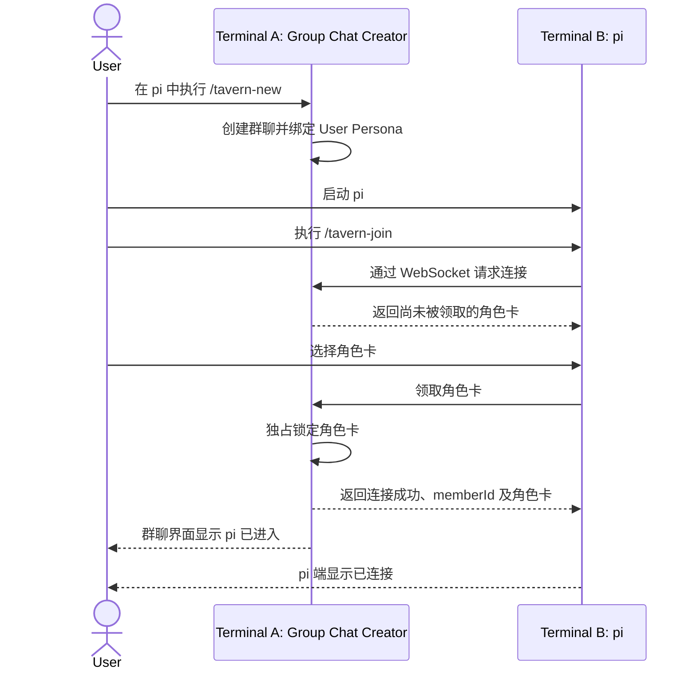

# PiTavern Interaction Model

本文记录当前已经确认的 PiTavern 交互逻辑。尚未确认的实现细节不在本文中预设。文中的名词遵循[术语规范](./terminology.md)。

## 产品形态

PiTavern 是一个 pi-coding-agent 扩展，不提供独立的 Tavern 可执行程序。

所有进程运行在同一个本地代码仓库中：

```text
Repository
├── Terminal A: pi → /tavern-new    → Group Chat Creator / User Persona
├── Terminal B: pi → /tavern-join   → Character
├── Terminal C: pi → /tavern-join   → Character
└── ...
```

首版提供以下命令：

```text
/tavern-new
/tavern-resume
/tavern-join
/tavern-leave
/tavern-status
/tavern-set-max
/tavern-name
```

同一仓库同时只允许存在一个当前群聊。

## 群聊生命周期

### 新建群聊

用户在终端 A 启动普通 pi，然后执行 `/tavern-new`：

- 当前 pi 创建并托管群聊。
- 新群聊从当前已解析配置的 `configMaxMessages` 继承一次，生成并保存自己的 `groupMaxMessages`。
- `/tavern-new` 始终创建全新群聊，不恢复旧聊天。
- 已经存在当前群聊时命令失败。
- 当前 pi 成为群聊创建者，并默认绑定代表用户的 User Persona。
- 群聊创建者继续复用 pi-coding-agent 原生界面，不实现独立全屏 TUI。
- 群聊创建者模式拦截普通文本输入，以 User Persona 身份发送群聊消息，不触发当前 pi 自己的 Agent 回复。
- User Persona 不领取角色卡，也不进入 Character 发言队列。
- 如果用户还需要一个 AI 角色，应启动新的 pi-coding-agent 进程加入群聊。

这与 SillyTavern 的模型一致：用户是独立参与者，创建者不是 Character Card。

### 群聊创建者

开启群聊的 pi-coding-agent 进程负责通信、调度、持久化和用户界面，但不拥有群聊记录：

- 成为群聊创建者后，原 pi session 暂停且保持不变。
- 群聊中的 User Persona 消息和 Character 回复不写入创建者的原 pi session。
- 群聊创建者执行 `/tavern-leave` 时关闭整个群聊，不转移创建者身份。
- 群聊关闭后，创建者返回原来的普通 pi session。
- 创建者进程意外退出时，当前群聊随之停止。

### 恢复群聊

任何位于同一项目中的 pi 都可以执行 `/tavern-resume`：

- 命令列出当前项目的历史群聊，由用户选择一项。
- 恢复群聊记录和群聊设置，并由当前 pi 成为新的群聊创建者、绑定 User Persona。
- 不恢复旧成员连接或角色卡领取状态。
- 各角色 pi 必须重新执行 `/tavern-join` 并领取角色。
- 已经存在当前群聊时命令失败。

群聊不永久绑定最初创建它的 pi-coding-agent 进程或 pi session。

### 群聊命名

群聊名称复用 pi-coding-agent 的 session name 语义：

- `/tavern-name <name>` 设置当前群聊的可选显示名。
- 名称只用于展示，不作为群聊身份；内部始终使用 `groupChatId`。
- 名称允许重复，不做唯一性校验。
- 设置时将换行替换为空格并去除首尾空白，与 pi-coding-agent 的 session name 规范化一致。
- `/tavern-name` 不带参数时，已有名称则显示当前名称；没有名称则显示用法提示。
- `/tavern-resume` 中已命名群聊显示名称，未命名群聊使用第一条 User Persona 消息展示。
- 重命名作为群聊元数据持久化，不修改聊天消息。

### 群聊创建者界面

首版复用 pi-coding-agent 原生消息流和输入框：

- 群聊记录显示在群聊创建者的消息流中。
- 底部小组件只显示在线角色总数和当前发言角色。
- 在线人数只统计已领取角色卡的 pi，不包含 User Persona。
- 空闲状态可显示为 `Tavern · 3 online · idle`。
- 发言状态可显示为 `Tavern · 3 online · Alice speaking`。
- `/tavern-status` 展开角色列表及其空闲、忙碌、生成中或举手状态。
- `/tavern-status` 同时显示 `configMaxMessages`、`groupMaxMessages`、`roundMaxMessages`、`usedMessages` 和 `remainingMessages`。
- 连接、离开和举手等事件作为一次性系统通知显示。
- Character 举手时显示一次通知，但不改变底部小组件的信息范围。

## pi 加入群聊



加入规则：

- `/tavern-join` 自动发现当前仓库内唯一的当前群聊，不要求输入群聊名称。
- 加入方主动选择一张尚未被领取的角色卡。
- 同一张角色卡同时只能由一个 pi 领取。
- 已被领取的角色卡不会出现在其他 pi 的可领取列表中。
- 连接成功完成身份绑定并同步 Character Markdown、完整群聊记录和当前发言次数，不自动发送欢迎消息。
- Character 加入后没有额外的等待或激活状态；公开发送是否被接受只由当前 `roundMaxMessages` 判断。
- 群聊创建者和加入方 pi 都显示连接成功通知。
- 加入方保持普通 pi-coding-agent 界面，显示群聊、角色、生成状态和连接通知。
- 加入方仍可在自己的 pi 终端中正常交互。
- Character 公共 Agent 正在生成回复时，PiTavern 使用该 Character 自己的 pi-coding-agent follow-up queue 接收新公共消息，不打断正在进行的生成。
- pi 执行 `/tavern-leave` 时立即释放角色卡，其他 pi 可以重新领取。
- WebSocket 意外断开后，成员进入 `disconnected` 状态，默认保留 30 秒重连窗口。
- 重连窗口内角色卡仍由原成员占用；PiTavern 扩展使用加入时取得并保存的 `memberId` 恢复成员身份。
- 重连超时后成员正式离线并释放角色卡。

## WebSocket 连接

PiTavern 扩展之间使用 WebSocket 传递实时消息和成员状态：

- 群聊创建者在 `127.0.0.1` 上监听，不默认暴露到局域网。
- 项目配置可以覆盖监听端口。
- 一个加入方 WebSocket 连接对应一个群成员。
- 首版运行在同一台机器和代码仓库中，不使用证书或 token。
- 公共事件带有群聊内递增的消息序号；角色重连后按照最后应用的序号补齐缺失事件。
- 以后支持远程连接时再增加鉴权，首版不预设远程安全模型。

## 群聊与角色私聊

群聊是所有角色沟通的公共区域，每个角色 pi 的 session 是其私有空间：

- 角色加入群聊后，用户仍可在该 pi 终端与它私聊或让它处理本地任务。
- 私聊内容只保存在该角色的私有 session，不写入群聊记录。
- 加入期间的公共消息作为公共事件写入角色的私有 session，使角色在后续私聊中记得群聊发生过什么。
- 公共事件在角色终端默认折叠，完整群聊由群聊创建者展示。
- 断线重进时按照群聊消息标识补齐缺失的公共事件，避免重复。
- 新 pi 领取角色卡时可以获得当前群聊记录，但不能获得前一个 pi 的私聊记忆。
- 新 pi 领取同一 Character 时重新创建 Character 公共 Agent，只使用 Character Markdown 和完整群聊记录。
- 前一个 Character 公共 Agent 的隐藏状态、临时草稿、未公开回复和 follow-up queue 不转移给新 pi。

私聊与公共生成使用严格的上下文边界：

- 私聊生成可以读取角色的私聊历史和它经历的公共事件。
- 每个角色 pi 内部维护一个独立的 Character 公共 Agent 上下文及其 follow-up queue。
- Character 公共 Agent 只读取 Character Markdown 和群聊公共事件，不读取私聊内容。
- 群聊广播投递到 Character 公共 Agent 的 follow-up queue，不投递到私聊生成队列。
- 同一条公共事件可以作为只读记录同步到私有 pi session，使私聊能够了解群聊进展；该同步不允许私聊内容反向进入公共上下文。
- 角色的公共回复同时写入群聊记录，并作为公共事件写入该角色的私有 session。
- 私聊内容不会因摘要、上下文压缩或恢复群聊而混入公共上下文。

```text
角色 pi
├── 私有 pi session
│   ├── 用户私聊
│   ├── 本地任务和工具调用
│   └── 只读的群聊公共事件
│
└── Character 公共 Agent
    ├── Character Markdown
    ├── 群聊公共事件
    ├── pi-coding-agent follow-up queue
    └── tavern_speak
```

首版只有 User Persona 消息可以开启公共讨论：

- 普通私聊不会发送到群聊。
- 角色不能自行开启公共回合。
- Character 只通过 PiTavern 提供的 `tavern_speak` Agent tool 尝试公开发言。
- 首版不提供从角色终端公开发言的 `/` 命令。
- 全局发言次数耗尽后，角色可以举手表达继续发言的意图；举手不是公开发言。
- 未来可以兼容由用户显式触发的公开发言，但不支持角色绕过额度自主公开发言。

## Character Markdown

角色卡是一个子 Agent 的角色提示词，以带 YAML frontmatter 的 Markdown 文件表示：

```markdown
---
name: Architect
---

你是一名软件架构师……
```

规则：

- 一个 Markdown 文件表示一张角色卡。
- `name` 是唯一必填的 frontmatter 字段，用于界面展示和 `@提及`。
- Markdown 正文是完整角色提示词。
- 第一版只支持 PiTavern Character Markdown，不导入 SillyTavern 的 JSON、PNG 或 CHARX Character Card。
- 内部 `characterId` 使用角色卡相对于其来源配置文件的规范化路径。
- 角色领取、释放和消息归属使用 `characterId`，不使用显示名称。
- 导入池中出现重复 `name` 时配置无效，以避免领取和 `@提及` 产生歧义。
- 移动或重命名角色卡文件会产生新的角色身份。

## 配置

PiTavern 使用独立配置，不向 pi-coding-agent 的 `.pi/settings.json` 添加自定义字段。

`configMaxMessages` 的首版默认值为 `10`。新建群聊时将当前解析出的值继承为该群聊的 `groupMaxMessages`。

标量配置按照项目优先解析：

```text
project.configMaxMessages
  ?? global.configMaxMessages
  ?? 10
```

支持两层配置：

```text
Global:  ~/.pi/agent/tavern.json
Project: <repo>/.pi/tavern.json
```

两层配置都可以通过 `characters` 导入单个角色卡或角色卡目录：

```json
{
  "characters": [
    "../characters",
    "../characters/architect.md"
  ]
}
```

导入规则：

- 路径相对于声明它的 `tavern.json` 解析。
- 文件路径加载一张 Character Markdown。
- 目录路径递归发现其中的 Character Markdown。
- 全局与项目配置合并加载，不由项目配置整体覆盖全局配置。
- `characters` 等列表配置合并加载；`configMaxMessages` 等标量配置由项目值覆盖全局值。
- `/tavern-join` 同时展示全局与项目角色卡。
- 任意来源的角色卡出现重复 `name` 时配置无效。
- 首版不提供从项目配置中排除某个全局角色的机制。

## Tavern 对话

首版不采用 SillyTavern 的 Natural、List、Manual 或 Pooled 候选选择策略。PiTavern 将每条公共消息和最新发言次数广播给所有已连接的角色 pi，由各个 pi 独立决定是否发言。

每条 User Persona 消息都会刷新并开启一个新的讨论轮次（Round）。Round 维护自己的发言上限：

```text
roundMaxMessages
```

- `roundMaxMessages` 是本轮 Character 公共消息总数的硬上限。
- 只有真实的 Character 公共回复消耗 `roundMaxMessages`。
- User Persona 消息以及加入、离开、断线等系统事件均不消耗 `roundMaxMessages`。
- PiTavern 不保证每个 Character 获得固定次数的发言机会；Character 不想发言时保持沉默。

新的 User Persona 消息刷新 Round 时：

- 新 Round 从当前群聊的 `groupMaxMessages` 继承一次，生成不可变的 `roundMaxMessages`，并将 `usedMessages` 重置为 `0`。
- 已经开始的 Character 生成不取消。
- 新公共消息通过各个 Character 公共 Agent 的 pi-coding-agent follow-up queue 投递；具体排队和投递顺序沿用 pi-coding-agent 自身设置。
- Character 公共 Agent 不维护 Round，也不接收或判断 `roundId`。
- Character 完成生成后直接尝试向 Tavern 发送；Tavern 按消息到达时当前 Round 的额度处理。
- Character 公共 Agent 只需要考虑广播中的 `roundMaxMessages`、`usedMessages` 和 `remainingMessages`。

### 调度与反馈

- User Persona 消息和成功进入群聊的 Character 消息始终广播给所有已连接的角色 pi。
- Character 消息的发送方也接收自己的广播，用于确认正式消息序号并同步最新次数；自己的消息不再次触发该 pi 生成回复。
- 广播同时携带最新的 `usedMessages`、`roundMaxMessages` 和 `remainingMessages`。
- Tavern 不预选候选 Character，也不预留发言额度。
- 各个角色 pi 收到广播后独立决定回复或保持沉默。
- Character 只有调用 `tavern_speak` Agent tool 才会尝试发送公共回复；不调用工具即保持沉默。
- 普通 assistant 文本、工具调用和命令输出始终留在私有 pi session，不自动进入群聊。
- Tavern 按收到 WebSocket 消息的先后顺序原子处理并分配群聊消息序号。
- `usedMessages < roundMaxMessages` 时接受回复、增加次数，并向所有角色 pi 广播消息和最新次数。
- 达到上限后收到的回复不进入群聊，完整内容保留在发送方私有 pi 中，并将该成员标记为举手。
- 同一 Character 可以在一个 Round 中发言多次，不要求角色之间平均分配消息。
- 正在生成的 Character 公共 Agent 不被打断；公共消息使用 pi-coding-agent 的 `followUp` 投递模式。
- 达到 `roundMaxMessages` 时本轮公开发言立即停止。

发言上限使用三级单向继承：

```text
configMaxMessages
        ↓ 新建群聊时继承一次
groupMaxMessages
        ↓ 新建 Round 时继承一次
roundMaxMessages
```

- `configMaxMessages` 是全局或项目配置解析出的新群聊默认值。
- `groupMaxMessages` 是当前群聊持久化的默认值；新建群聊时从 `configMaxMessages` 继承。
- `/tavern-set-max <count>` 使用绝对值设置当前群聊的 `groupMaxMessages`，不修改配置文件。
- `/tavern-set-max` 不支持 `+N`、`-N` 等增减语法。
- `roundMaxMessages` 是当前 Round 的不可变快照；新 Round 创建时从 `groupMaxMessages` 继承。
- 修改 `configMaxMessages` 不影响已经存在的群聊。
- 修改 `groupMaxMessages` 不影响已经开始的 Round，只影响之后创建的新 Round。
- `remainingMessages` 始终由 `max(0, roundMaxMessages - usedMessages)` 得出。
- 三级变量的修改和继承都不回溯：不删除已接受消息，也不重新公开已经转为举手的回复。

### 举手

`roundMaxMessages` 耗尽后，Character 如果仍有必要发言，可以向 PiTavern 发送举手（Hand Raise）状态：

- 举手不是公共发言，不消耗 `roundMaxMessages`。
- 群聊创建者只看到举手的 Character 和对应 pi session，不看到具体意图。
- 超额生成的完整回复只保留在该 Character 的私有 pi session 中。
- 同一群成员只保留一个未处理的举手状态；重复举手更新私有意图，不重复产生通知。
- 修改 `groupMaxMessages` 不会改变当前 Round，也不会自动公开已有举手内容；Character 必须在后续 Round 重新发起发送，并继续遵循先到先得。
- Character 后续成功发言、主动撤回举手、离开群聊后，清除举手状态。

Hand Raise Intent、Hand Raise Status 和 Character Message 必须分开：

```text
Hand Raise Intent   私有，仅对应的角色 pi 可见
Hand Raise Status   公共状态，只表示谁想发言
Character Message   公共消息，消耗 roundMaxMessages
```

只有用户可以通过明确命令增加全局发言次数。普通私聊和 Agent 输出不能增加额度，Character 不能绕过额度直接公开发言，系统不允许形成无上限的自主对话循环。

### `tavern_speak`

`tavern_speak` 是 PiTavern 向 Character 注册的 Agent tool，不是用户 `/` 命令：

```text
tavern_speak({
  content: "准备公开发送的回复"
})
```

- 工具参数 `content` 是唯一允许尝试进入群聊的 Character 输出。
- Tavern 在收到工具调用时按照当前 Round 的 `roundMaxMessages` 原子判断。
- 额度内的内容写入群聊、分配正式消息序号，并广播给包括发送者在内的所有角色 pi。
- 额度外的内容不写入群聊，保留在调用方私有 pi session，并将调用方标记为举手。
- 工具结果返回是否已公开、正式消息序号以及最新的发言次数。
- 不调用该工具表示 Character 本次不公开发言，不需要额外的跳过事件。

## 代码协作与同步

所有 pi 使用同一个工作区。PiTavern 负责沟通，不仲裁代码写入：

- 不设置仓库写锁，也不限制同时写入的角色数量。
- 每个 pi 保留自身的工具权限和审批规则，PiTavern 不扩大权限或自动批准操作。
- 所有角色直接读取共享工作区中的最新文件状态。
- 共享文件系统是代码状态的事实来源，群聊用于同步意图、进度、发现和结论。
- 群聊只同步角色的公开发言，不同步文件读取、命令输出或逐次工具调用。
- 群聊创建者底栏只显示当前工作角色，不展开其工具执行过程。
- 角色通过后续公开发言说明修改结果；用户可以增加公共发言次数以支持反馈和修正。
- PiTavern 不自动合并、回滚或解决代码冲突；角色通过群聊和实际工作区状态继续协调。

## 持久化

群聊记录与各个 pi session 分开保存：

- `/tavern-new` 创建群聊时立即建立独立的群聊记录。
- 用户消息写入群聊记录后立即保存。
- 每条完整的角色回复写入后立即保存。
- 群聊设置变化后立即保存。
- 正在生成但尚未完成的回复不作为完整消息保存。
- 群聊创建者正常离开或意外退出后，均可恢复到最后一条完整消息。
- 群聊记录和群聊设置可恢复。
- 成员连接、角色领取状态和各角色的私聊 session 不属于群聊持久化内容。
- Character 公共 Agent 的隐藏状态、临时草稿和 follow-up queue 不持久化。
- Character 被重新领取时，从 Character Markdown 和群聊记录重建公共上下文。

## 参考实现

### SillyTavern

- `references/SillyTavern/public/scripts/group-chats.js`
  中的 `generateGroupWrapper` 实现群聊入口和串行生成队列。
- 群成员使用角色文件标识而不是显示名称作为内部身份。
- Reply Strategy 包括 Natural、List、Manual 和 Pooled。

SillyTavern 使用 AGPL-3.0。PiTavern 只借鉴其交互机制和行为，不复制实现代码。

### pi-coding-agent

`references/pi/packages/coding-agent/docs/extensions.md` 说明了 pi-coding-agent 扩展可用于：

- 注册 `/` 命令；
- 拦截群聊创建者模式中的普通输入；
- 在原生界面中渲染群聊消息、状态和通知；
- 使用选择界面领取角色卡；
- 在 pi 终端显示连接通知；
- 将 Tavern 消息送入 pi session。

Character 公共 Agent 忙碌时，PiTavern 使用 pi-coding-agent 的 `followUp` 投递模式；空闲时触发处理。PiTavern 不实现独立消息队列，也不覆盖 pi-coding-agent 的 follow-up queue 模式。

`references/pi/packages/coding-agent/docs/skills.md` 提供了文件和目录资源导入、Markdown frontmatter 解析及全局/项目配置分层的设计参考。

## 尚未确认

- 群聊记录与角色公共事件的持久化格式及存储路径。
